# JVM 知识

## 1. 内存结构

### 1.1 内存结构概览


  <center style="font-size:18px;color:#1E90FF">图1.内存结构简图</center> 


  <center style="font-size:18px;color:#1E90FF">图2.内存结构详细图</center> 

### 1.2 类加载子系统


  <center style="font-size:18px;color:#1E90FF">图3.类加载子系统</center>

负责从文件系统或者网络中加载Class文件,class文件在文件开头有特定的文件标识

类加载器(Class Loader)只负责class文件的加载,至于它是否可以运行,由执行引擎(Execution Engine)决定。

加载的**类信息**存放于一块称为**方法区**的内存空间。 除了类信息之外，方法区中还会存放**运行时常量池信息**，可能还包括字符串字面量和数字常量（这部分常量信息是class文件中常量池部分的内存映射）

- **加载（Loading）**

    1. 通过一个类的全限定名获取定义此类的二进制字节流
    2. 将这个字节流所代表的静态存储结构转化为方法区的运行时数据结构
    3. **在内存中生成一个代表这个类的java.lang.Class对象**，作为方法区这个类的各种数据的访问入口

- **链接（Linking）**

    1. 验证(Verify):

       主要包含四种验证, **文件格式验证，元数据验证，字节码验证，符号引用验证**。

       目的在于确保class文件的字节流中包含信息符合当前虚拟机要求，保证被加载类的正确性，不会危害虚拟机自身安全。

    2. 准备(Prepare):

       为**类变量**分配内存并设置该类变量的**默认初始值，即零值**。

       ```java
       public class Demo{
           private static int a = 1; // 此阶段(prepare): a = 0 
           // Initialization阶段才赋值 a = 1
       }
       ```

       ***这里不包含用final修饰的static，因为final修饰此时是个常量，final在编译的时候就会分配了，准备阶段会显示初始化***

       这里不会为实例变量分配初始化值，类变量会分配在方法区中，而实例变量是会随着对象一起分配到java堆中。

    3. 解析(Resolve):

       **将常量池内的符号引用转换为直接引用的过程。**

       **事实上，解析操作往往会伴随着jvm在执行完初始化之后再执行。**

       符号引用就是一组符号来描述所引用的目标。符号引用的字面量形式明确定义在《java虚拟机规范》的class文件格式中。直接引用就是直接指向目标的指针、相对偏移量或者一个间接定位到目标的句柄。

       解析动作主要针对类或者接口、字段、类方法、接口方法、方法类型等。对常量池中的CONSTANT_ClASS_INFO、CONSTANT_FIELDREF_INFO、CONSTANT_METHODREF_INFO等。

- **初始化(Initialization)**

  初始化阶段就是执行类构造器方法<clinit>()的过程。

  此方法不需要定义，是javac编译器**自动收集**类中的**所有类变量的赋值动作和静态代码块中的语句**合并而来的。

  构造方法中指令按语句在源文件中出现的顺序执行。

  ```java
  	public class Demo {
          private static int num = 1;
          static {
              num = 2;
              number = 20;
          }
          private static int number = 10; // 链接(linking)的prepare阶段： number = 0; initial阶段: 先20再10, 最终 number=10; 
      }
  ```

  <clinit>() 不同于类的构造器。（关联：构造器是虚拟机视角下的<init>())

  若该类具有父类，JVM会保证字类的<clinit>()执行之前，父类的<clinit>()已经执行完毕。

  **虚拟机必须保证一个类的<clinit>() 方法在多线程下被同步加锁**。

#### 1.2.1 类加载器

从jvm角度，类加载器分为两种类型

1. 引导类（启动类）加载器(Bootstrap ClassLoader) （Native代码C++语言实现的）
2. 其他加载器(所有派生于抽象类ClassLoader的类加载器)（Java 实现的）


  <center style="font-size:18px;color:#1E90FF">图4.ClassLoader类图</center>

从开发角度分为4种

1. 引导类（启动类）加载器BootstrapClassLoader
2. 拓展类加载器ExtensionClassLoader（ExcClassLoader）
3. 系统类加载器SystemClassLoader（AppClassLoader）
4. 自定义加载器


<center style="font-size:18px;color:#1E90FF">图5.类加载器</center>

   这里的四者之间的关系是**组合关系**（包含）。而不是父子继承关系。例如一各文件夹/a/b/c.txt，c的上一级是b，b的上一级是a，但是不能说a、b、c之间是一种继承关系，或者可以这样理解，类的加载器是具有等级制度的，等级跟等级之间可以理解为上下级也行，但是不能理解为继承关系。

根据一下代码简单理解下类加载器之间的层级关系

```java
public class ClassLoaderDemo {
    public static void main(String[] args) {
        // 获取系统类加载器
        ClassLoader systemClassLoader = ClassLoader.getSystemClassLoader();
        System.out.println(systemClassLoader);

        // 获取其上一级： 扩展类加载器
        ClassLoader extClassLoader = systemClassLoader.getParent();
        System.out.println(extClassLoader);

        // 获取其上一级：获取不到引导类加载器
        ClassLoader bootstrapClassLoader = extClassLoader.getParent();
        System.out.println(bootstrapClassLoader);

        // 获取用户自定义类的类加载器
        ClassLoader classLoader = ClassLoaderDemo.class.getClassLoader();
        System.out.println(classLoader);

        // 获取java类库Strin类的类加载器
        ClassLoader classLoader1 = String.class.getClassLoader();
        System.out.println(classLoader1);
    }
}

/** 结果
sun.misc.Launcher$AppClassLoader@18b4aac2
sun.misc.Launcher$ExtClassLoader@74a14482
null
sun.misc.Launcher$AppClassLoader@18b4aac2
null

第一行返回了一个系统类加载器
第二行返回说明了拓展类加载器为系统类加载器的上层
第三行返回结果为空，获取不到引动类加载器bootstrapclassloader，因为bootstrapclassloader是native(c++)语言编写的
第一行和第四行结果说明用户自定义的类默认使用的是系统类加载器进行加载的
第三行和第五行结果说明Java的核心类库都是使用引导类加载器(bootstrapclassloader)进行加载的
*/
```

无论类加载器的类型如何划分，在程序中我们最常见的类加载器始终只有3个。

- **启动类加载器（Bootstrap ClassLoader）**
  - 这个类加载器使用C/C++语言实现的，嵌套在JVM内部
  - 它用来加载Java的核心类库（JAVA_HOME/jre/lib/rt.jar、resources.jar或sun.boot.class.path路径下的内容），用于提供JVM自身需要的类
  - 并不继承自java.lang.ClassLoader，没有父类加载器（C++实现的肯定不可能再去继承java的体系结构了）
  - 加载拓展类和应用类加载器，并指定为他们的父类加载器
  - 出于安全考虑，BootstrapClassLoader只加载包名为java、javax、sun等开头的类
- **拓展类加载器（Extension ClassLoader）**
  - java语言编写，有sun.misc.Launcher$ExtClassLoader实现。（Launcher的内部类）
  - 派生于ClassLoader类
  - 父类加载器为启动类加载器（BootstrapClassLoader）
  - 从java.ext.dirs系统属性所指定的目录中加载类库，或从JAVA_HOME/jre/lib/ext目录下加载类库。**如果用户创建的JAR放在此目录下，也会自动由拓展类加载器加载**
- **应用程序加载器（系统类加载器，AppClassLoader）**
  - java语言编写，有sun.misc.Launcher$AppClassLoader实现。（Launcher的内部类）
  - 派生于ClassLoader类
  - 父类加载器为启动类加载器（BootstrapClassLoader）
  - 它负责加载环境变量classpath或者系统属性java.class.path指定路径下的类库
  - **该类加载器是程序中默认的类加载器**，一般来说，Java应用的类都是由它来完成加载
  - 通过ClassLoader#getSystemClassLoader()方法可以获取到该类加载器


#### 1.2.2  **ClassLoader类**

ClassLoader类，它是一个抽象类，其后所有的类加载器都继承自ClassLoader（不包括启动类加载器BootstrapClassLoader）

ClassLoader主要方法

| 方法名称                                             | 描述                                                         |
| ---------------------------------------------------- | ------------------------------------------------------------ |
| loadClass(String name)                               | 加载名称为name的类，返回结果为java.lang.Class类的实例        |
| findClass(String name)                               | 查找名称为name的类，返回结果为java.lang.Class类的实例        |
| findLoaded(String name)                              | 查找名为name的已经被加载过的类，返回结果为java.lang.Class类的实例 |
| defineClass(String name, byte[] b, int off, int len) | 把字节数组b中的内容转换为一个Java类，返回结果为java.lang.Class类的实例 |
| resovleClass(Class<?> c)                             | 连接指定的一个java类                                         |
| getParent()                                          | 返回该类加载器的超类加载器                                   |

几种获取ClassLoader的途径

```javascript
// 方式1. 获取当前类的ClassLoader
clazz.getClassLoader()
example:
	Class.forName("java.lang.String").getClassLoader();
// 方式2. 获取当前线程上下文的ClassLoader
Thread.currentThread().getContextClassLoader()
// 方式3. 获取系统的ClassLoader
ClassLoader.getSystemClassLoader()
// 方式4. 获取调用者的ClassLoader
DriverManager.getCallerClassLoader()
```


#### 1.2.3  **双亲委派机制**

Java虚拟机对class文件采用的是**按需加载**的方式，依旧是说当需要使用该类时才会将它的class文件加载到内存生成class对象。而且加载某个类的class文件时，java虚拟机采用的是双亲委派模式，即把请求交由父类处理，它是一种任务委派模式。

**工作原理：**

1. 如果一个类加载器收到了类加载请求，它并不会自己先去加载，而是把这个请求委托给父类的加载器去执行

2. 如果父类的加载器还存在其父类加载器，则进一步向上委托，依次递归，请求最终将到达顶层的启动类加载器

3. 如果父类加载器可以完成类加载任务，就成功返回，倘若父类加载器无法完成此加载任务，子类加载器才会尝试自己去加载，这就是双亲委派模式。

   
   
   <center style="font-size:18px;color:#1E90FF">图6.双亲委派</center>

代码示例理解:

```java
// 在src下自己创建一个java.lang包，创建一个String类
package java.lang;

public class String {
    static {
        System.out.println("自定义String类静态方法");
    }
}
```

```java
package org.example;

public class StringTest {
    public static void main(String[] args) {
        String str = new java.lang.String();
        System.out.println("hello world");
        
        StringTest test = new StringTest();
        System.out.println(test.getClass().getClassLoader());
    }
}

/** 结果
hello world
sun.misc.Launcher$AppClassLoader@18b4aac2

从结果来看,静态代码块没有被执行，说明String并没有加载自己定义的String类。
而是加载了java核心类库定义的String类。由此说明当加载String时，一直向上委派，委派到BootstrapClassLoader时，
发现该类是以java.开头属于启动类加载器的加载范围，因此启动类加载器直接加载了java核心类库的String类。
而StringTest类向上委托时，BootstrapClassLoader和ExtensionClassLoader发现
StringTest不在他们的加载路径下，最终交由系统类加载器自己加载
*/
```

```java
// 在自定义java.lang包的String类种加入main方法
package java.lang;

public class String {
    static {
        System.out.println("自定义String类静态方法");
    }

    public static void main(String[] args) {
        System.out.println("hello,string");
    }
}

/** 结果
错误: 在类 java.lang.String 中找不到 main 方法, 请将 main 方法定义为:
   public static void main(String[] args)
否则 JavaFX 应用程序类必须扩展javafx.application.Application

从此结果来看，main方法执行时,此时需要加载Strin类，类在加载的时候根据双亲委派机制，加载了java核心类库的String类，核心类库中String是没有main方法的
因此此时去执行main方法，就会报错
*/
```

```java
package java.lang;

public class Demo {
    public static void main(String[] args) {
        System.out.println("hello, demo");
    }
}
/** 结果
Error: A JNI error has occurred, please check your installation and try again
Exception in thread "main" java.lang.SecurityException: Prohibited package name: java.lang
	at java.lang.ClassLoader.preDefineClass(ClassLoader.java:655)
	at java.lang.ClassLoader.defineClass(ClassLoader.java:754)
	at java.security.SecureClassLoader.defineClass(SecureClassLoader.java:142)
	at java.net.URLClassLoader.defineClass(URLClassLoader.java:468)
	at java.net.URLClassLoader.access$100(URLClassLoader.java:74)
	at java.net.URLClassLoader$1.run(URLClassLoader.java:369)
	at java.net.URLClassLoader$1.run(URLClassLoader.java:363)
	at java.security.AccessController.doPrivileged(Native Method)
	at java.net.URLClassLoader.findClass(URLClassLoader.java:362)
	at java.lang.ClassLoader.loadClass(ClassLoader.java:418)
	at sun.misc.Launcher$AppClassLoader.loadClass(Launcher.java:355)
	at java.lang.ClassLoader.loadClass(ClassLoader.java:351)
	at sun.launcher.LauncherHelper.checkAndLoadMain(LauncherHelper.java:601)

如果能被加载，那么可能会对引导类加载器造成印象，为了安全性和核心API被随意篡改，不允许用户自定义类使用核心api的包名命名
*/
```

**双亲委派的优势：**

- 避免类的重复加载
- 保护程序安全，防止核心API被随意篡改
  - 自定义类： java.lang.String
  - 自定义类： java.lang.Demo

**沙箱安全机制**

上述自定义String类时，会先使用BootstrapClassLoader进行加载，在加载过程中会先加载jdk自带的文件(rt.jar包中的java\lang\String.class), 报错信息说没有main方法，因为加载的是rt.jar包下的String类。这样可以保证对java核心源代码的安全保护，这就是沙箱安全机制。


#### 1.2.4  **其他**

**在jvm中表示两个class对象是否为同一个对象存在两个必要条件：**

1. 类的完整类名必须一致，包括包名。
2. 加载这个类的ClassLoader（指ClassLoader实例对象）必须相同

换句话说，在jvm中，即使这两个类对象（class对象）来源于同一个Class文件，被同一个虚拟机所加载，单只要加载它们的ClassLoader实例对象不同，那么这两个类对象也是不相等的。


jvm必须知道一个类型是由启动加载器加载的还是由其他类加载器加载的。

**如果一个类型是由其他类加载器加载的，那么jvm会将这个类加载器的一个引用作为类型信息的一部分保存在方法区中。**

当解析一个类型到另有一个类型的引用的时候，jvm需要保证这两个类型类加载器是相同的（不太理解时，学习动态链接）。


java程序对类的使用分为：主动使用（会初始化）和被动使用。

- 主动使用又分为七种

  - 创建类的实例
  - 访问某个类或接口的静态变量，或者对该静态变量赋值
  - 调用类的静态方法
  - 反射（比如 Class.forName(“xxx”)）
  - 初始化一个类的字类
  - Java虚拟机启动时被标记为启动类的类
  - JDK 7 开始提供的动态语言支持： java.lang.invoke.MethodHandle实例解析结果REF_getStatic、REF_putStatic、REF_invokeStatic句柄对应的类没有初始化，则初始化
- 除了以上7中，其他使用Java类的方法都是被看作是对类的被动使用，**都不会导致类的初始化**

### 1.3 运行时数据区


<center style="font-size:18px;color:#1E90FF">图7.数据加载图</center>

​	网络或者硬盘上的数据要被CPU计算，首先需要先加载到内存然后再经过CPU加载计算，内存是非常重要的系统资源，是CPU和硬盘的中间仓库及桥梁，承载着操作系统和应用程序的试试以运行。JVM内存布局规定了Java在运行过程中内存申请、分配、管理的策略，保证了JVM的高效率稳定运行。**不同的jvm对于内存的划分方式和管理机制存在着部分差异。**


<center style="font-size:18px;color:#1E90FF">图8.JDK8运行时数据区结构</center>

  JDK1.8将方法区替换成了元空间使用的是本地内存。

  Java虚拟机定义了若干种程序运行期间会使用到的运行时数据区，其中有一些会随着虚拟机启动而创建，随着虚拟机退出而销毁。另外一些则是与线程一一对应的，这些线程对应的数据区域会随着线程开始和结束而创建和销毁。因此分为线程私有区域和线程公用区域。

- 每个线程私有： 程序计算器，本地方法栈，虚拟机栈
- **线程间共享**： 堆、堆外内存（永久代或者元空间，代码缓存区）


<center style="font-size:18px;color:#1E90FF">图9.运行时数据区划分</center>

  **每个JVM只有一个Runtime实例。即为运行时环境，相当于内存结构的中间的那个框框：运行时环境（运行时数据区）。**

#### 1.3.1  **程序计数器（PC寄存器 Program Counter Register）**

JVM中的程序计数寄存器（Program Counter Register）中，Register的命名源于CPU的寄存器，寄存器存储指令相关的现场信息。CPU只有把数据装载到寄存器才能够运行。这里并非是广义上所指的物理寄存器，或许将其翻译为PC计数器（或指令计数器）会更加贴切（也成为程序钩子），并且不容易引起一些不必要的误会。**JVM中的PC寄存器是对物理PC寄存器的一种抽象模拟。**

**作用： PC寄存器用来存储指向下一条指令的地址，也即将要执行的指令代码。由执行引擎读取下一条指令。**


<center style="font-size:18px;color:#1E90FF">图10.PC寄存器</center>

1. 它是一块很小的内存空间，几乎可以忽略不记。也是运行速度最快的存储区域。
2. 在JVM规范中，每个线程都有自己的程序计数器，是线程私有的，生命周期与线程的生命周期保持一致。
3. 任何时间一个线程都只有一个 方法在执行官，也就是所谓的当前方法。程序计数器会存储当前线程正在执行的Java方法的JVM指令地址；或者，如果是在执行native方法，则是未指定值（undefined)。（因为这里指的是java层面的东西，调用C就显示不出来了）
4. 它是程序控制流的指示器，分支、循环、跳转、异常处理、线程恢复等基础功能都需要依赖这个计数器来完成。
5. 字节码解释器工作时就是通过改变这个计数器的值来选取下一条需要执行的字节码指令。
6. **它是唯一一个在Java虚拟机规范中没有规定任何OutOfMemeryError情况的区域。**


<center style="font-size:18px;color:#1E90FF">图11.PC寄存器示例图</center>

- **使用PC寄存器存储字节码指令地址有什么用？为什么使用PC寄存器记录当前线程的执行地址？**

  因为CPU需要不停的切换各个线程，这时候切换回来以后，就得知道接着从哪开始继续执行。JVM的字节码解释器就需要通过改变PC寄存器的值来明确下有一条应该执行什么样的字节码指令。

- **PC寄存器为什么会被设定为线程私有**

  所谓的多线程在有一个特定的时间段内只会执行其中某一个线程的方法，CPU会不停的做任务切换，这样必然导致经常中断或恢复，为了能够准确地记录各个线程正在执行的当前字节码指令地址，最好的办法自然是为每一个线程都分配一个PC寄存器，这样一来各个线程之间便可以进行独立计算，从而不会出现互相干扰的情况。
  
  

#### 1.3.2  **虚拟机栈**(JVM Stacks)


<center style="font-size:18px;color:#1E90FF">图12.跨平台性</center>

Java具有跨平台性的。一次编译，多次执行。虽然各个平台的Java虚拟机内部实现细节不尽相同，但是他们共同执行的字节码内容却是一样的。


<center style="font-size:18px;color:#1E90FF">图13.代码执行流程</center>

Java编译器编译过程中，任何一个节点执行失败就会造成编译失败。

Java 虚拟机使用类加载器（Class Loader）加载class文件。类加载完成之后，会进行字节码校验，字节码校验通过后，JVM解释器会把字节码翻译成机器码（即：汇编语言）交由操作系统执行。

操作系统并不识别字节码指令，只能够识别机器指令，JVM的主要任务就是负责将字节码装载到其内部，解释/编译为对应平台的机器指令（即：汇编语言）执行


<center style="font-size:18px;color:#1E90FF">图14.语言翻译</center>

但不是所有代码都是解释执行的，JVM对此做了优化。比如，以Hotspot虚拟机来说，它本身提供了JIT(Just in Time)


##### **1.3.2.1 JVM的架构模型**

Java编译器输入的指令流基本上是一种**基于栈的指令集架构**，另外一种指令集架构则是**基于寄存器的指令集架构**。

- **基于栈式架构的特点：**
  - 设计和实现更简单，适用于资源受限的系统。
  - 避开了寄存器的分配难题：使用零地址指令方式分配。
  - 指令流中的指令大部分是零地址指令，其执行过程依赖于操作栈。指令集更小，编译器容易实现。
  - 不需要硬件支持，可以执行更好，更好实现跨平台。
- **基于寄存器架构的特点：**
  - 典型的应用是x86的二进制指令集：比如传统的PC以及Android的Davlik虚拟机。
  - 指令集架构则完全依赖硬件，可以执行差
  - 性能优秀和执行更高效。
  - 花费更少的指令去完成一项操作。
  - 在大部分情况下，基于寄存器架构的指令集往往都以一地址指令、二地址指令和三地址指令为主。

由于跨平台性的考虑，**Java的指令都是根据栈来设计的**。不同平台CPU架构不同，所以不能设计为基于寄存器的。栈式由于式基于内存，入栈出栈，不依赖硬件。有点是跨平台性，指令集小，编译器容易实现，缺点是性能 下降，实现同样的功能需要更多的指令。

**栈是运行时的单位，而堆是存储的单位。**即：栈解决程序的运行问题，即程序如何之心，或者说如何处理数据。堆解决的是数据存储的问题，即数据怎么放，放哪里。

Java虚拟机栈（Java Virtual Machine Stack)，早期也叫Java栈。每个线程在创建时都会创建一个虚拟机栈，其内部保存一个个的栈帧（Stack Frame）,对应一次次的方法调用。**Java虚拟机栈是线程私有的，生命周期和线程一致，主管Java进程的运行，它保存方法的局部变量，部分结果，并参与方法的调用和返回。**


**栈的特点：**

- 栈是一种快速有效的分配存储方式，访问速度仅次于程序计数器。
- JVM直接对Java栈的操作只有两个：
  - 每个方法执行，伴随着进栈（入栈、压栈）
  - 执行结束之后的出栈工作
- 对于栈来说，不存在垃圾回收问题。

**栈中可能出现的两个异常：**

- Java 虚拟机规范允许Java栈的大小是动态的或者是固定不变的（通过参数  **-Xss** [stack size]设置线程的最大栈空间，栈的大小直接决定了函数调用的最大可达深度, eg. -Xss 10m）。

  - 如果采用固定大小的Java虚拟机栈，那每一各线程的Java虚拟机栈容量可以在线程创建的时候独立选定。如果线程请求分配的栈容量超过虚拟机栈允许的最大容量，Java虚拟机将会抛出一个**StackOverflowError**异常。

    ```java
    // 栈溢出举例
    public class StackOverFlowDemo {
        public static void main(String[] args) {
            main(args);
        }
    }
    ```

    

  - 如果Java虚拟机栈可以动态扩展，并且在尝试拓展的时候无法申请到足够的内存，或者在创建新的线程时没有足够的内存区创建对应的虚拟机栈，那么Java虚拟机将会抛出一个**OutOfMemoryError**异常。

**栈中存储什么？**

每个线程都有自己的栈，栈中的数据都是以**栈帧(Stack Frame)**的格式存在。

在这个线程上正在执行的每个方法都各自对应一个栈帧。

栈帧是一个内存区块，是一个数据集，维系着方法执行过程中的 各种数据信息。

**栈运行原理**

JVM直接对栈的操作只有两个，就是对栈帧的**压栈**和**出栈**，遵循**“先进后出”/“后进先出”**原则。

在一条活动线程中，一个时间点上，只会有一个活动的栈帧。即只有当前正在执行的方法的栈帧（栈顶栈帧）是有效的，这个栈帧被称为**当前栈桢（Current Frame）**，与当前栈帧相对应的方法就是当前方法（Current Method），定义这个方法的类就是当前类（Current Class）

执行引擎运行的所有字节码指令只针对当前栈帧进行操作。如果在该方法中调用了其他方法，对应的新栈帧会被创建出来，放在栈的顶端，成为新的当前桢。

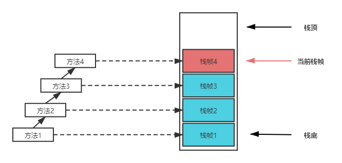

<center style="font-size:18px;color:#1E90FF">图15.方法与栈帧</center>

不同的线程中所包含的栈帧是不允许存在相互引用的，即不可能在一个栈帧之中引用另外一个线程的栈帧。

如果当前方法调用了其他方法，方法返回之际，当前栈帧会传回此方法的执行结果给前一个栈帧，接着，虚拟机会丢弃当前栈帧，使得前一个栈帧重新成为当前栈帧。Java方法有两种返回函数的方式，**一种是正常的函数返回，使用return指令。另一种是抛出异常。不管用哪种方式，都会导致栈帧被弹出。**


##### **1.3.2.2 栈帧的内部结构 **

- 局部变量表（Local Variables）
- 操作数栈（Operand Stack）（或表达式栈）
- 动态链接（Dynamic Linking）（或者指向运行时常量池的方法引用）
- 方法返回地址（Return Address）（或方法正常退出或者异常退出的定义）
- 一些附加信息

（动态链接、方法返回地址、附加信息又称为桢数据区）


<center style="font-size:18px;color:#1E90FF">图16.栈帧内部结构</center>


##### **1.3.2.3 局部变量表**

- 局部变量表也被称之为局部变量数组或本地变量表。
- 为一个**数字数组**，主要用于存储**方法参数**和定义在**方法体内的局部变量**，这些数据类型包括各类基本数据类型、对象引用（reference），以及returnAddress类型。
- 由于局部变量表是建立在线程的栈上，是线程私有的数据，因此**不存在数据安全问题**。
- **局部变量表所需的容量大小是在编译器确定下来的**，并保存在方法的maximum local variable数据项中。在方法运行期间是不会改变局部变量表的大小的。
- **方法嵌套调用的次数由栈的大小决定。**一般来讲，**栈越大，方法嵌套调用次数越多**。对于一个函数而言它的参数和局部变量越多，使得局部变量表膨胀，它的栈帧就越大，以满足方法调用所需传递的信息增大的需求。进而函数调用就会占用更多的栈空间，导致其嵌套调用次数就会减少。
- **局部变量表中的变量只在当前方法调用中有效**。在方法执行时，虚拟机通过使用局部变量表完成参数值到参数变量列表的传递过程。**当方法调用结束后，随着方法栈帧的销毁，局部变量表也会随之销毁**。

- 局部变量表，最基本的存储单元是Slot（变量槽）
- 参数值的存放总是在局部变量数组的index0开始，到数组长度-1的索引结束。
- 局部变量表中存放编译期可知的各种基本数据类型（8种），引用类型（reference），returnAddress类型的变量
- 在局部变量表里，32位以内的类型只占用一个slot（包括returnAddress类型），64位类型（long和double）占用两个slot。
  - byte、short、char在存储前被转换位int，boolean也转换为int，0表示false，1表示true
  - long和double则占据两个slot
  


<center style="font-size:18px;color:#1E90FF">图17.slot理解</center>

- JVM会为局部变量表的每一个Slot都分配一个访问索引，通过这个索引即可成功访问到局部变量表中指定的局部变量

- 当一个实例方法被调用的时候，它的方法参数和方法体内部定义的局部变量将会**按照顺序**被复制到局部变量表中的每一个Slot上

- **如果需要访问局部变量表中一个64bit的局部变量值时，只需要使用第一个索引即可**（如 q 占据4、5，只需要访问4就行）。

- 如果当前桢是由**构造方法**或者**实例方法**创建的，**那么该对象引用this将会存放在index为0的Slot处**，其余的参数按照参数表顺序继续排列。（这就是为什么静态方法不能使用this的原因，因为在静态方法的局部变量表里面，不存在this变量）

- Slot的重复利用：**栈帧种的局部变量表中的槽位是可以重复利用的**，如果一个局部变量过了其作用域，那么在其作用域之后申明的新的局部变量就很有可能会复用过期局部变量的槽位，**从而达到节约资源的目的**。

  ```java
  public class SlotDemo {
      public void slotTest() {
          int a = 0;
          {
              int b = 0;
              b = a + 1;
          }
          int c = a + 1;
      }
  } 
  ```


**变量的分类：**

- 按照数据类型
  - 基本数据类型变量
  - 引用数据类型变量
- 按照类中声明位置
  - 成员变量（在使用前，都经历过默认初始化赋值）
    - 类变量（static修饰的）： Linking的prepare阶段：给类变量默认赋值 --》 initial阶段：给类变量显示赋值及静态代码块赋值
    - 实例变量（非static修饰的）： 随着对象的创建，会在堆空间中分配实例变量空间，并进行默认赋值
  - 局部变量： 在使用前，必须要显示赋值！否则，编译不通过

在栈帧中，与性能调优关系最为密切的部分就是前面提到的局部变量表。在方法执行时，虚拟机使用局部变量表完成方法的传递。

**局部变量表中的变量也是重要的垃圾回收根节点，只要被局部变量表中直接或间接引用的对象都不会被回收。**


##### **1.3.2.4 操作数栈 （数组实现）**

- 每一个独立的栈帧中除了局部变量表之外，还包含一个后进先出的操作数栈，也称之为表达式栈。


- 操作数栈，在方法执行过程中，根据字节码指令，往栈中写入数据或提取数据，即入栈/出栈。（默写字节码指令将值压入操作数栈，其余的字节码指令将操作数取出栈。使用它们后（如执行复制，交换，求和等操作）再把结果压入栈。


<center style="font-size:18px;color:#1E90FF">图18.操作数</center>


- 操作数栈，**主要用于保存计算过程中的中间结果，同时作为计算过程中变量临时的存储空间。**
- 操作数栈就是JVM执行引擎的一个工作区，当一个方法刚开始执行的时候，一个新的栈帧也会随之被创建出来，**这个方法的操作数栈是空的。（空并不代表没有创建，数组一旦创建，其长度就是确定的）**
- **每一个操作数栈都会拥有一个明确的站深度用于存储数值，其所需的最大深度在编译期就定义好了**，保存在方法的Code属性中国，为max_stack的值
- 栈中的任何一个元素都是可以任意的Java数据类型
  - 32bit的类型占用一个栈单位深度
  - 64bit的类型占用2个栈单位深度
- 操作数栈**并非采用访问索引的方式来进行操作数据的，而是只能通过标准的入栈（push）和出栈（pop）操作来完成一次数据访问。**
- 如果被调用的方法带有返回值的化，其返回值将会被压入当前栈帧的操作数栈中，并更新PC寄存器中下一条需要执行的字节码指令
- 操作数栈中元素的数据类型必须与字节码执行的序列严格匹配，这由编译器在编译期间进行验证，同时类加载过程中的类检验阶段的数据流分析需要再次验证
- Java虚拟机的**解释引擎是基于栈的执行引擎**，其中的栈指的就是操作数栈。

**代码演示：**

```java
public class OperandStackTest {
    public void testAddOperation() {
        byte i = 15;
        int j = 8;
        int k = i + j;
    }
}
```


<center style="font-size:18px;color:#1E90FF">图19.操作数栈追踪</center>

- 第一步，执行PC寄存器记录指令地址所在指令，将值15压入操作数栈
- 第二步，取出操作数栈的数据15放到局部变量表索引为1的位置，（非静态方法索引为0的位置放了this变量）
- 第三步，将值8压入操作数栈
- 第四步，取出操作数栈的数据8放到局部变量表索引为2的位置
- 第五步，取出局部变量表坐标为1的15入栈
- 第六步，取出局部变量表坐标为1的8入栈
- 第七步，取出操作数栈中的15和8做求和计算再压入操作数栈
- 第八步，将23存到局部变量表坐标为3的位置
- 第九步，退出返回

**常见的 i++ 和 ++i的区别（通过字节码理解）**

待总结

**栈顶缓存技术**

基于栈式架构的虚拟机所使用的零地址指令更加紧凑，但完成一项操作的时候必然需要使用更多的入栈和出栈指令，这同时也就意味着将需要更多的指令分派次数和内存读写次数。

由于操作数是存储在内存中的，因此频繁地执行内存读/写操作必然会影响执行速度。为了解决这个问题，Hotspot JVM的设计者们提出了**栈顶缓存技术,将栈顶元素全部缓存在物理CPU的寄存器中**,以此降低对内存的读/写次数，提升执行引擎的执行效率。


##### **1.3.2.5 动态链接**（或指向运行时常量池的方法引用）

- 每一个栈帧内部都包含一个**指向运行时常量池中该栈帧所属方法的引用**。包含这个引用的目的就是为了支持当前方法的代码能够实现**动态链接（Dynamic Linking）**。比如invokedynamic指令
- 在Java源码文件被编译到字节码文件中时，所有的变量和方法引用都作为符号引用（Symbolic Reference）保存在class文件的常量池中。比如：描述一个方法调用了另外的其他方法时，就是通过常量池中指向方法的符号引用来表示的，**那么动态链接的作用就是为了将这些符号引用转换为调用方法的直接引用。**
- 常量池的作用就是为了以提供一些符号和常量，便于指令的识别。


<center style="font-size:18px;color:#1E90FF">图20.动态链接</center>

**方法的调用**

在JVM中，将符号引用转化为调用方法的直接引用与放过发的绑定机制相关。

对应方法的绑定机制有早期绑定和晚期绑定。绑定时一个字段、方法或者类在符号引用被替换为直接引用的过程，这仅仅发生一次。

- 静态链接：

  当一个字节码文件在被装载进JVM内部时，如果被调用的**目标方法在编译期可知**，且在运行期保持不变时。这种情况下将调用方法的符号有引用转换为直接引用的过程称之为静态链接。

  - 对应方法的绑定机制为：早期绑定，就是指**被调用的目标方法如果在编译期可知，且运行期保持不变时，即可将这个方法与所属的类型进行绑定**，这样一来，由于明确了被调用的目标方法究竟是哪一个，因此也就可以使用静态链接的方式将符号引用转换为直接引用。

- 动态链接：

  如果**被调用的方法在编译期无法被确定下来**，也就是说，只能够在程序运行期将调用方法的符号引用转换为直接引用，由于这种引用转换过程具备动态性，因此也就被称之为动态链接。

  - 对应方法的晚期绑定机制： 如果**被调用的方法在编译期无法被确定下来，只能够在程序运行期根据实际的类型绑定相关的方法**，这种绑定方式也就被称为晚期绑定。

**虚方法与非虚方法**

- 非虚方法
  - 如果方法在编译期就确定了具体的调用版本，这个版本在运行时是不可变的。这一样的方法成为非虚方法。
  - 静态方法、私有方法、final方法、实例构造器、父类方法都是非虚方法
- 虚方法
  - 以上之外的其他方法为虚方法


虚拟机中提供了以下几条方法调用指令：

- 普通调用指令
  - invokestatic：调用静态方法，解析阶段确定唯一方法版本
  - invokespecial：调用<init>方法、私有及父类方法，解析阶段确定唯一方法版本
  - invokevirtual：调用所有虚方法
  - invokeinterface：调用接口方法
- 动态调用指令
  - invokedynamic：动态解析出需要调用的方法，然后执行

前四条指令固化在虚拟机内部，方法的调用执行不可人为干预，而invokedynamic指令则支持由用户确定方法版本。其中**invokestatic指令和invokespecial指令调用用的方法成为非虚方法，其余的（final修饰除外）称为虚方法**

**Java语言中方法重写的本质：**

1. 找到操作数栈顶的第一个元素所执行的对象的实际类型，记作 C。
2. 如果在类型C中找到与常量中的描述符合简单名称都相符的方法，则进行访问权限校验，如果通过则返回这个方法的直接引用，查找过程结束。如果不通过，则返回java.lang.IllegalAccessError异常。
3. 否则，按照继承关系从下往上一次对C的各个父类进行第2步的搜索和验证过程。
4. 如果始终没有找到合适的方法，则抛出java.lang.AbstractMethodError异常。

IllegalAccessError介绍：

程序试图访问或修改一个属性或调用一个方法，这个属性或方法，你没有权限访问。一般的，这个会引起编译器异常。这个错误如果发生在运行时，就说明一个类发生了不兼容的改变。

##### **1.3.2.6 方法返回地址**

- 存放调用该方法的pc寄存器的值。
- 一个方法结束，由两种形式：1. 正常执行完成。2.  出现未处理的异常，非正常退出。
- 无论通过哪种方式退出，在方法退出后都返回到该方法被调用的位置。方法正常退出时，**调用者的PC计数器的值作为返回地址，即调用该方法的指令的下一条指令的地址。**而通过异常退出的，返回地址是要通过异常表来确定，栈帧中一般不会保存这部分信息。
- 本质上，方法的退出就是当前栈帧出栈的过程。此时，需要恢复上层方法的局部变量表、操作数栈、将返回值压入调用者栈帧的操作数栈、设置PC寄存器值等，让调用者方法继续执行下去。
- **正常完成出口和异常完成出口的区别在于：通过异常完成出口退出的不会给他的上层调用者产生任何的返回值。**

当一个方法开始执行后，只有两种方式可以退出这个方法：

1. 执行引擎遇到任意一个方法返回的字节码指令（return），会有返回值传递给上层的方法调用者，简称正常完成出口。

   1. 一个方法在正常调用完成之后究竟需要使用哪一个返回指令还需要根据方法返回值的实际数据类型而定。
   2. 在字节码指令中，返回指令包含ireturn（当返回值是boolean、byte、char、short和int类型时使用）、lreturn、freturn、dreturn以及areturn，另外还有一个return指令供声明为void的方法、实例初始化方法、类和接口的初始化方法使用。

2. 在方法执行的过程中遇到了异常（Exception），并且这个异常没有在方法内进行处理，也就是只要在本方法的异常表中没有搜索到匹配的异常处理器，就会导致方法退出。简称**异常完成出口**。

   方法执行过程中抛出异常时的异常处理，存储在一个异常处理表，方便在发生异常的时候找到处理异常的代码。

```
  public static void main(java.lang.String[]);
    descriptor: ([Ljava/lang/String;)V
    flags: ACC_PUBLIC, ACC_STATIC
    Code:
      stack=2, locals=4, args_size=1
         0: ldc           #2                  // class org/example/App
         2: invokevirtual #3                  // Method java/lang/Class.getClassLoader:()Ljava/lang/ClassLoader;
         5: ldc           #4                  // String consume.properties
         7: invokevirtual #5                  // Method java/lang/ClassLoader.getResourceAsStream:(Ljava/lang/String;)Ljava/io/InputStream;
        10: astore_1
        11: new           #6                  // class java/util/Properties
        14: dup
        15: invokespecial #7                  // Method java/util/Properties."<init>":()V
        18: astore_2
        19: aload_2
        20: aload_1
        21: invokevirtual #8                  // Method java/util/Properties.load:(Ljava/io/InputStream;)V
        24: goto          32
        27: astore_3
        28: aload_3
        29: invokevirtual #10                 // Method java/io/IOException.printStackTrace:()V
        32: aload_2
        33: ldc           #11                 // String aa
        35: invokevirtual #12                 // Method java/util/Properties.getProperty:(Ljava/lang/String;)Ljava/lang/String;
        38: astore_3
        39: getstatic     #13                 // Field java/lang/System.out:Ljava/io/PrintStream;
        42: aload_3
        43: invokevirtual #14                 // Method java/io/PrintStream.println:(Ljava/lang/String;)V
        46: return
      Exception table:
         from    to  target type
            19    24    27   Class java/io/IOException  // 如果时19-24行指令地址发生异常按照27行处理方式处理
```

##### **1.3.2.7 附加信息**

栈帧中还允许携带与Java虚拟机实现相关的一些附加信息。例如，对程序调试提供支持的信息。

##### **1.3.2.8 关于虚拟机栈的几个面试题**

1. 举例栈溢出的情况（StackOveflowError）
   1. 通过设置-Xss设置栈的大小，当栈空间不足的 时候就出现StackOverflowError
   2. 如果不设置栈大小，自动扩容的，当栈帧不断添加，超过内存空间时，会出现OOM。
2. 调整栈大小，就能保证不出现溢出吗？ 不能
3. 分配的栈内存越大越好吗？不是，根据情况而定，栈越大占用的内存就越大，但是其他内存结构中就相对越少。其他地方就容易出现溢出等情况。
4. 垃圾回收是否会涉及到虚拟机栈？ 不会的
5. 方法中定义的局部变量是否线程安全？具体问题具体分析，如果这个变量只在当前线程当前方法内区操作那么就是线程安全的，如果这个变量定义后，需要和被多个线程共享，就可能存在线程不安全的情况。如main方法定义了一个StringBuilder对象 s。然后在main方法中创建了两个线程，都对s进行操作。就存在线程安全问题。


#### 1.3.3  **本地方法栈（Native Method Stacks）**

可以先看1.4 再回来看这节

- Java虚拟机栈用于管理Java方法的调用，而本地方法栈用于管理本地方法的调用
- 本地方法栈，也是线程私有的。
- 允许被实现成固定或者是动态扩展的内存大小。（在内存溢出方面是相同的）
  - 如果线程请求分配的栈容量超过本地方法栈允许的最大容量，Java虚拟机将会抛出一个StackOverflowError异常
  - 如果本地方法栈式可以动态扩容的，并且在尝试扩展的时候无法申请到足够的内存，或者在创建新的线程时没有足够的内存去创建对应的本地方法栈，那么Java虚拟机将会抛出一个OutOfMemoryError异常
- 本地方法是C语言实现的。
- 它的具体做法是Native Method Stack中登记native方法，在Execution Engine执行时加载本地方法库。
- **当某个线程调用一个本地方法时，它就进入了一个全新的并且不在受虚拟机限制的世界。他和虚拟机拥有同样的权限。**
  - 本地方法可以通过本地方法接口**来访问虚拟机内部的运行时数据区**
  - 它甚至可以直接使用本地处理器中的寄存器
  - 直接从本地内存的堆中分配任意数量的内存
- 并不是所有的JVM都支持本地方法。因为Java虚拟机规范并没有明确要求本地方法栈的使用语言、具体实现方式、数据结构等。如果JVM产品不打算支持native方法，也可以无需实现本地方法栈。
- 在Hotspot JVM中，直接将本地方法栈和虚拟机栈合二为一。


#### 1.3.4  **堆（Heap）**

- 一个JVM实例只存在一个堆内存，堆也是Java内存管理的核心区域。
- Java 堆区在JVM启动的时候即被创建，其空间大小也就确定了。是JVM管理的最大一块内存空间。
  - 堆内存的大小是可以调节的。
- Java虚拟机规范规定，堆可以**处于物理上不连续的内存空间中，但在逻辑上它应该被视为连续的**。
- **所有的线程共享Java堆，在这里还可以划分线程私有的缓冲区（Thread Local Allocation Buffer，TLAB）**
- Java虚拟机规范中堆Java堆的描述是：**所有的对象实例以及数组都应当在运行时分配在堆上**。（应该是几乎所有，因为还有栈上分配的情况）
- **数组和对象可能永远不会存储在栈上**，因为栈帧中保存引用，这个引用指向对象或者数组在队中的位置。

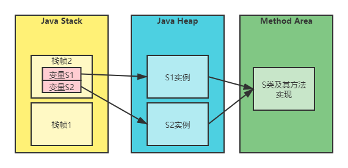

<center style="font-size:18px;color:#1E90FF">图21.动态链接</center>

- 在方法结束后，堆中的对象不会立马被移除，仅仅在垃圾回收的时候才会被移除。
- 堆，是GC（Garbage Collection，垃圾收集器）执行垃圾回收的重点区域。


##### **1.3.4.1 内存细分**

现代垃圾收集器大部分都基于分带收集理论设计，堆空间细分为：


<center style="font-size:18px;color:#1E90FF">图22.堆</center>

- **Java 7及之前**堆内存逻辑上分为三部分： 新生代 + 老年代 + **永久区**
  - Young Generation Space						新生区		Young/New
    - 又被划分为Eden区和Survivor区
  - Tenure Generation Space                      养老区        Old/Tenure
  - **Permanent Space                                    永久区        Perm**
- **Java 8及之后**堆内存逻辑上分为三部分： 新生代 + 老年代 + **元空间**
  - Young Generation Space						新生区		Young/New
    - 又被划分为Eden区和Survivor区
  - Tenure Generation Space                      养老区        Old/Tenure
  - **Meta Space                                              元空间        Meta**

约定： 新生区 --> 新生代 --> 年轻代， 养老区 --> 老年区 --> 老年代，  永久区 --> 永久代


<center style="font-size:18px;color:#1E90FF">图23.堆参数作用区域</center>

##### **1.3.4.2 堆空间大小的设置**

- **-Xms**     用来设置堆空间（年轻代+老年代）的初始内存大小，默认为物理电脑内存的 1/64 。
  - -X   是jvm的运行参数
  - ms 是memory start
- **-Xmx**   用来设置堆空间（年轻代+老年代）的最大内存大小, 默认为物理电脑内存的 1/4 。
- 一旦堆区中的内存大小超过 "-Xmx"所指定的最大内存时，将会抛出OutOfMemoryError异常
- 通常会将 -Xms 和 -Xmx 两个参数配置相同值，**其目的是为了能够在java垃圾回收机制清理完堆区后不需要重新分隔计算堆区大小，从而提高性能**
- 查看设置的参数
  - jps 获取进程id ，然后  **jstat -gc**	进程id
  - **-XX:+PrintGCDetails** 根据GC信息分析查看相关内存大小


##### **1.3.4.3 年轻代与老年代**

- 存储在JVM中的Java对象可以被划分为两类：

  - 一类是生命周期较短的瞬时对象，这类对象的创建和消亡都非常迅速
  - 另外一类对象的生命周期却非常长，在某些极端的情况下还能够与JVM的声明周期保持一致

- Java堆区进一步细分的话，可以划分为年轻代（YoungGen）和老年代（OldGen）

- 其中年轻代又可以划分为Eden空间，Survior0空间和Survivor1空间（有时也叫做from区、to区）

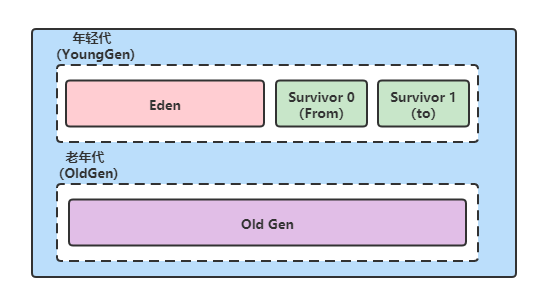

<center style="font-size:18px;color:#1E90FF">图24.堆空间划分</center>

- 配置新生代与老年代在堆结构的占比,一般开发中不会调整这些参数
  - 默认 **-XX：NewRatio**=2，表示新生代占1，老年代占2，新生代占整个堆内存的1/3。
  - 可以修改 -XX:NewRatio=4, 表示新生代占1，老年代占4，新生代占整个堆内存的1/5。
  - **-XX:SurvivorRatio**: 设置新生代中Eden区与Surviror区的比例，默认是8
    - **-XX:-UseAdaptiveSizePolicy**：关闭自适应的内存分配策略。（实际使用时验证会发现默认比例不是8而是6，是因为开启了自适应分配策略。）
  - 在Hotspot中，Eden空间和另外两个Survivor空间缺省所占比例是8:1:1
  - **几乎所有**的java对象都是在Eden区被new出来的。
  - 绝大部分的Java对象的销毁都在新生代进行了
    - IBM公司的专门研究表明,新生代中80%的对象都是“朝生夕死”的。
  - 可以使用选项 “**-Xmn**” 设置新生代最大内存大小
    - 这个参数一般使用默认值就可以了


<center style="font-size:18px;color:#1E90FF">图25.堆空间分代比例</center>

##### **1.3.4.4 对象分配过程**


<center style="font-size:18px;color:#1E90FF">图26.对象分配过程</center>

- 当对象创建以后，首先分配到Eden区，当Eden满的时候，进行YoungGC（Minor GC），将目前还存活的对象提升到幸存者区S0（S0和S1也称from区和to区，空的区域我们称之为to区，此时S0是to区），我们会为每个对象分配一个年龄计数器，记录垃圾回收时存活次数。
- 继续往Eden区存放对象的时候，当Eden再次满的时候，又触发了YoungGC，将目前Eden区还存活的对象放到幸存者区S1中（此时S1是to区），此时如果S0区中还有存活对象，那么将S0中的对象存放到S1区当中。S0晋升到S1的存活对象年龄加1。此时为2。S0区清空变成to区。
- 对象不断的存储并触发GC，某次触发GC的时候，此时Eden有对象仍然存活，然后放置到S0区，S1区中此时有三个对象存储，发现有一个年龄为1的对象仍然存活，将之存放到S0区中，另外两个年龄为15的对象也存活，发现此时这两对象的年龄达到阈值15，将两对象晋升到老年代。存放到Old区中。**15是默认次数。可以通过参数 -XX:MaxTenuringThreshold=<N>进行设置。**
- **注意：只有Eden区满的时候才会触发YoungGC，Survivor区满的时候不会触发YoungGC（但并不是说Survivor区就没有YoungGC，当Eden区满的时候，Survivor区也会被动的进行GC）**
- **针对幸存者S0，S1区： 复制之后有交换，谁空谁是to区**
- **关于垃圾回收：频繁在新生区收集，很少在养老区收集，几乎不在永久区/元空间收集**


<center style="font-size:18px;color:#1E90FF">图26.对象分配特殊情况</center>

- 当对象相对较大的时候，判断Eden区是否放得下，放得下直接分配内存，Eden区放不下，先触发YGC。
- 然后再次判断Eden区是否能够放下。如果Eden区放不下，判断Old区是否放得下。放得下直接分配。
- 当Old放不下时，触发FGC，此时如果Old区还放不下，则报OOM。
- 在进行YoungGC时，顺便也会对Survivor区进行垃圾回收，垃圾回收时，判断to区是否还能放下存活对象
- 如果放不下，直接晋升到老年代。S0或者S1区中有对象超过阈值时，也会晋升至老年代。


##### **1.3.4.5 Minor GC、Major GC与Full GC**

JVM在进行GC时，并非每次都对上面三个内存区域（新生代、老年代、方法区）一起回收的，大部分时候回收的都是指新生代。

**针对Hotspot VM的实现，它里面的GC按照回收区域又分为两大类型： 一种是部分收集（Partial GC），一种是整堆收集（Full GC）**

- 部分收集： 不是完整收集整个Java堆的垃圾收集。其中又分为
  - 新生代收集（Minor GC/Young GC）：只是新生代的垃圾收集
  - 老年代收集（Major GC/Old GC）：只是老年代的垃圾收集
    - 目前，只有CMS GC会又单独收集老年代的行为。
    - **注意，很多时候Major GC会和Full GC混淆使用，需要具体分辨是老年代回收还是整堆回收。**
  - 混合收集（Mixed GC）：收集整个 新生代以及部分老年代的垃圾收集。
    - 目前，只有 G1 GC 会有这种行为
- 整堆收集（Full GC）：收集整个java堆和方法区的垃圾收集


**年轻代GC（Minor GC）触发机制：**

- 当年轻代空间不足时，就会触发Minor GC,这里的年轻代满指的是Eden区满，Survivor满不会触发GC。（每次Minor GC会清理年轻代的内存）
- 因为Java对象大多都具备朝生夕死的特性，所以Minor GC非常频繁，一般回收速度也比较快。这一定义既清晰又易于理解
- Minor GC会因为（STW），暂停使用其用户的线程，等垃圾回收结束，用户线程才恢复运行（Stop The World）。

**老年代GC（Major GC/Full GC）触发机制：**

- 指发生在老年代的GC，对象从老年代消失时，我们说“Major GC”或“Full GC”发生了
- 出现Major GC，经常会伴随至少一次的Minor GC（但非绝对的，在ParallelScavenge收集器的收集策略里就有直接进行Major GC的策略选择过程）
  - 也就是在老年代空间不足时，会先尝试触发Minor GC。如果之后空间还不足，则触发Major GC
- Major GC的速度一般会比Minor GC慢10倍以上，STW的时间更长
- 如果Major GC之后，内存还不足，就报OOM

**Full GC 触发机制：（后面细讲）**

触发Full GC执行的情况有五种：

1. 调用System.gc()时，系统建议执行Full GC，但是不必然执行
2. 老年代空间不足
3. 方法区空间不足
4. 通过Minor GC后进入老年代的平均大小大于老年代的可用内存
5. 有Eden区、survivor space0（From Space）区向survivor space1（To Space）区复制时，对象大小大于To Space可用内存，则把该对象转存到老年代，且老年代的可以用内存小于该对象大小

**说明：full  gc是开发或调优中尽量要避免的，这样暂停时间会短一些。**


##### **1.3.4.6 堆空间的分代思想**

为什么需要把Java堆分代？不分代就不能正常工作了吗？

不同对象的声明周期不同，经研究，70%~99%的对象是临时对象，朝生夕死的。在分代思想里，新生代存放新创建的对象，有Eden和两块大小相同的Survivor（也称from/to,s0/s1）构成，to区总为空。老年代：存放新生代中经历多次GC仍然存活的对象。

其实不分代完全可以，分代的唯一理由就是优化GC性能。如果没有分代，那所有的对象都在一块，就如同把一个学校的人都关在一个教室。GC的时候要找到哪些对象没用，这样就会对堆的所有区域进行扫描。而很多对象都是朝生夕死的，如果分代的话，把新创建的对象放到某一块，当GC的时候先把这块存储“朝生夕死”对象的区域进行回收，这样就会腾出很大的空间来。


##### **1.3.4.7 内存分配策略（或对象提升（Promotion）规则**

针对不同年龄段的对象分配原则如下：

- 优先分配到Eden
- 大对象直接分配到老年代
  - 尽量避免程序中出现过多的大对象
- 长期存活的对象分配到老年代
- 动态对象年龄判断
  - 如果Survivor区中相同年龄的所有对象大小的总和大于Survivor空间的一半，年龄大于或等于该年龄的对象可以直接进入老年代，无需等到MaxTenuringThreshold中要求的年龄
- 空间分配担保
  - -XX:HandlePromotionFailure

##### **1.3.4.8 TLAB（Thread Local Allocation Buffer）**

**为什么需要TLAB？**

- 堆区是线程共享区域，任何线程都可以访问到堆区中的共享数据
- 由于对象实例的创建在JVM中非常频繁，**因此在并发环境下从堆区中划分内存空间是线程不安全的**。
- 为避免多个线程操作同一地址，需要使用加锁等机制，进而影响分配速度。

**什么是TLAB?**

- 从内存模型而不是垃圾收集的角度，对Eden区域继续进行划分，**JVM为每个线程分配了一个私有缓存区域**，它包含在Eden空间内。

- 多线程同时分配内存时，使用TLAB可以避免一系列的非线程安全问题，同时还能提升内存分配的吞吐量，因此我们可以将这种内存分配方式称之为快速分配策略
  

  <center style="font-size:18px;color:#1E90FF">图27.TLAB</center>

- 尽管不是所有的对象实例都能够在TLAB中成功分配内存,但**JVM确实是将TLAB作为内存分配的首选**。

- 在程序中，通过"-XX:UseTLAB"设置是否开启TLAB空间，默认是开启的。

- 默认情况下，TLAB空间的内存非常小，仅占整个Eden空间的1%，当然我们可以通过选项 "-XX:TLABWasteTargetPercent"设置TLAB空间所占用Eden空间的百分比大小。

- 一旦对象在TLAB空间分配内存失败时，JVM就会尝试着通过**使用加锁机制**确保数据操作的原子性，从而直接在Eden空间中分配内存。

  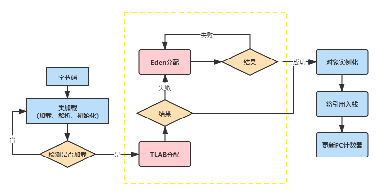

  <center style="font-size:18px;color:#1E90FF">图28.对象分配进阶</center>


##### **1.3.4.8  堆空间常用的JVM参数**

- -XX:+PrintFlagsInitial ：查看所有的参数的默认初始值
- -XX:+PrintFlagsFinal ： 查看所有的参数的最终值（可能会存在修改，不再是初始值）
- -Xms: 初始堆空间内存大小（默认为物理内存的1/64）
- -Xmx: 最大堆空间内存（默认为物理内存的1/4）
- -Xmn: 设置新生代的大小
- -XX:NewRatio: 配置新生代与老年代在堆结构的占比
- -XX:SurvivorRatio: 设置新生代中Eden和S0/S1空间的比例
- -XX:MaxTenuringThreshold: 设置新生代垃圾的最大年龄
- -XX:+PrintGCDetails: 输出详细的GC处理日志
  - 打印GC简要信息：1. -XX:PrintGC  2. -verbose:gc
- -XX:HandlePromotionFailure: 是否设置空间分配担保


##### **1.3.4.9  补充**

随着JIT编译器的发展与**逃逸分析技术**逐渐成熟**，栈上分配、标量替换优化技术**将会导致一些微妙的变化，所有的对象都分配到堆上也渐渐变得不那么“绝对”了。

在Java虚拟机中，对象是在Java堆中分配内存的，这是一个普遍的常识。但是，有一种特殊情况，那就是如果**经过逃逸分析后发现，一个对象并没有逃逸出方法的话，那么就可能被优化成栈上分配**。这样就无需在堆上分配内存，也无需进行垃圾回收了。这就是最常见的堆外存储技术。

此外，基于OpenJDK深度定制的TaoBaoVM，其中创新的GCIH（GC invisible heap）技术实现off-heap，将生命周期较长的Java对象从heap中移至heap外，并且GC不能管理GCIH内部的Java对象，以此达到降低GC的回收频率和提升GC的回收效率的目的

**逃逸分析：**

如何将堆上的对象分配到栈，需要使用逃逸分析手段。这是一种可以有效减少Java程序中同步负载和内存堆分配压力的跨函数全局数据流分析算法。为什么分配到栈上，首先栈每个线程各自一份，所以不存在数据同步问题。第二个栈中每个方法存放的是一个个栈帧，方法执行结束之后栈桢就出栈了，空间相当于得到了释放，而且栈空间不存在GC，不影响性能。

通过逃逸分析，Java Hotspot编译器能够分析出**一个新得对象的引用的使用范围**从而决定是否要将这个对象分配到栈上。

逃逸分析的基本行为就是分析对象动态作用域：

- 当一个对象在方法中被定义后，对象旨在方法内部使用，则任务没有发生逃逸，则可以分配到栈上，随着方法执行的结束，栈空间就被移除
- 当一个对象在方法中被定义后，它被外部方法所引用，则认为发生逃逸。例如作为调用参数传递到其他地方中。

**代码分析：**

```java
public class Demo {
    public Demo obj;
    
    // 方法返回Demo对象，发生逃逸
    public Demo getInstance() {
        return obj == null ? new Demo() : obj;
    }
    
    // 发生逃逸，因为obj可能存在被其他地方使用的情况
    public void setObj() {
        this.obj = new Demo();
    }
    
    // 对象d的作用域仅在当前方法中有效，没有发生逃逸，可以使用栈上分配
    public void useDemo() {
        Demo d = new Demo();
    }
    
    // 有可能引用了成员变量obj，发生逃逸
    public void useThisDemo() {
        Demo d = getInstance();
    }
    
}
```

参数设置：

从JDK7开始，Hotspot中默认已经开启了逃逸分析。

通过 -XX:+DoEscapeAnalyysis 显示开启逃逸分析，选项 -XX:+PrintEscapeAnalysis 查看逃逸分析得筛选结果

**使用逃逸分析，编译器可以堆代码做如下优化：**

- **栈上分配。**将堆分配转换为栈分配。如果一个对象在子程序中被分配，要使指向该对象的指针永远不会逃逸，对象就可能是栈分配的候选，而不是堆分配。

  - JIT编译器在编译期间根据逃逸分析结果，发现如果一个对象没有发生逃逸，就可能被优化成栈上分配。分配完成后，继续在调用栈内执行，最后线程结束，栈空间也被回收了，局部变量对象也被回收。这样就无需进行垃圾回收了。

- **同步省略。**如果一个对象被发现只能从一个线程被访问到，那么对这个对象的同步操作可以不考虑同步。

  - 线程同步的代价是相当高的，同步的后果是降低并发性和性能。在动态编译同步块的时候，JIT编译器可以结组逃逸分析来**判断同步块所使用的锁对象是否只能够被一个线程访问而没有被发布到其他线程**。如果没有，那么JIT编译器在编译这个同步块的时候就会取消对这部分代码的同步。这样就能大大提高并发性和性能。这个取消同步的过程就叫同步省略，也叫锁消除。

- **分离对象或表两个替换。**有的对象可能不需要作为一个连续的内存结构存在也可以被访问到，那么对象的部分（或全部）可以不存储在内存，而是存储在CPU寄存器中。

  - **标量**是指一个无法再分解成更小的数据的数据。Java中的原始数据类型就是标量。相对的，那些还可以分解的数据叫做**聚合量（Aggregate）**，Java中的对象就是聚合量，因为它可以分解成其他聚合量和标量。在JIT编译阶段，如果经过逃逸分析，发现一个对象不会被外界访问的话，那么经过JIT优化，就会把这个对象拆解成若干个成员变量来替换。这个过程就是变量替换。

    ```java
    public static void main(String[] args) {
        alloc();
    }
    
    private static void alloc() {
        Point p = new Point(1, 2);
        System.out.println("point.x=" + p.x +";point.y=" + p.y);
    }
    
    class Point {
        private int x;
        private int y;
    }
    ```

    上面代码，经过标量替换后，就会变成：

    ```java
    private static void alloc() {
        int x = 1;
        int y = 2;
        System.out.println("point.x=" + x +";point.y=" + y);
    }
    ```

    这样做的好处就是可以大大减少堆内存的占用，因为一旦不需要创建对象了，那么就不再需要分配堆内存了。-XX:+EliminateAllocations: 参数也用来开启标量替换，默认是打开的，允许将对象打散分配在栈上。

在开发中能使用局部变量的，就不要使用在方法外定义。

使用参数设置案例： -server -Xmx100m -Xms100m  -XX:+DoEscapeAnalyysis -XX:+EliminateAllocations -XX:+PrintGC 。

注意： -server 启动Server模式，因为在Server模式下，才可以开启逃逸分析，客户端模式下没有逃逸分析


#### 1.3.5  **方法区（Method Area [Metaspace]）**

##### **1.3.5.1 运行时数据区划分**


  <center style="font-size:18px;color:#1E90FF">图29.运行时数据区结构图</center>

  

  <center style="font-size:18px;color:#1E90FF">图30.数据共享角度运行时数据区划分</center>

  

  <center style="font-size:18px;color:#1E90FF">图31.栈堆方法区的交互关系</center>

Java虚拟机规范中明确说明：“尽管所有的方法区在逻辑上是属于堆的一部分，但一些简单的实现可能不会选择区进行垃圾收集或者进行压缩。”但是对应Hotspot JVM而言，方法区还有一个别名叫做Non-Heap（非堆），目的就是要和堆分开。所以，方法区看作是一块独立于Java堆的内存空间。

- 方法区（Method Area）与Java堆一样，是各个线程共享的内存区域
- 方法区在JVM启动的时候被创建，并且它的实际物理内存空间和Java堆区一样都可以是不连续的。
- 方法区的大小，跟堆空间一样，可以选择固定大小或者可扩展。
- 方法区的大小决定了系统可以保存多少个类，如果系统定义了太多的类，导致方法区溢出，虚拟机同样会抛出内存溢出错误：java.lang.OutOfMemoryError: PermGen space (JDK1.8之前) / Metaspace (JDK1.8后)
  - **例如加载大量的第三方jar包；tomcat部署的工程过多（30-50个）**
- 关闭JVM就会释放这个区域的内存


##### **1.3.5.2 Hotspot中方法区的演进**

- **在JDK1.7及以前，习惯上把方法区成为永久代。JDK8开始使用元空间取代了永久代**

- 本质上，方法区和永久代并不等价。仅是对Hotspot虚拟机而言的。Java虚拟机规范对如何实现方法区，不做统一要求。例如BEA JRockit/IBM J9中不存在永久代的概念
  - 现在来看，当年使用永久代，不是好的idea。（使用永久代时，也就是jdk1.7及之前用的都是JVM的内存，而JDK1.8之后元空间使用的是本地内存）导致Java程序更容易OOM（超过-XX:MaxPermSize上限）

  

  <center style="font-size:18px;color:#1E90FF">图32.方法区</center>

- 而到了JDK 8，终于完全废弃了永久代的概念。改用与JRockit，J9一样在本地内存中实现的元空间（Metaspace）来替代

- 元空间的本质和永久代类似，都是对JVM规范中方法区的实现。不过元空间与永久代最大的区别在于：**元空间不在虚拟机设置的内存中，而是使用本地内存。**

- 永久代，元空间二者并不只是名字变了，内部结构也调整了

- 根据Java虚拟机规范的规定，如果方法区无法满足新得内存分配需求时，将抛出OOM异常。


##### **1.3.5.3 设置方法区大小与OOM**

- 方法区的大小不必是固定的，jvm可以根据应用的需要动态调整
- jdk7及以前
  - 通过 -XX:PermSize来设置永久代初始分配空间。默认是20.75m
  - -XX:MaxPermSize来设定永久代最大可分配空间。32为机器默认是64m，64位机器默认是82m
  - 当JVM加载的类信息容量超过这个值，就会报OutOfMemoryError: PermGen space
- JDK8及以后
  - 元数据大小可以使用参数 -XX:MetaspaceSize和-XX:MaxMetaspaceSize指定，替代上述原有的两个参数
  - 默认值依赖于平台。windows下，-XX:MetaspaceSize是21m，-XX:MaxMetaspaceSize的值为-1，即没有限制
  - 与永久代不同，如果不指定大小，默认情况下，虚拟机会耗尽所有的可用系统内存。如果元数据区发生溢出，虚拟机一样会抛出OutOfMemoryError: Metaspace
  - -XX:MetaspaceSize: 设置初始的元空间大小。对于一个64位的服务器端JVM来说其默认的-XX:MetaspaceSize为21m。这就是初始的高水位线，一旦触及这个水位线，Full GC将会被触发并卸载没用的类（即这些类对应的类加载器不再存活），然后这个高水位线将会重置。新的高水位线的值取决于GC后释放了多少元空间。如果释放的空间不足，那么在不超过MaxMetaspaceSize时，适当提高该值。如果释放空间过多，则适当降低该值。
  - 如果初始化的高水位线设置过低，上述高水位线调整情况会发生很多次。通过垃圾回收器的日志可以观察到Full GC多次调用。为了避免频繁地GC，建议将-XX:MetaspaceSize设置为一个相对较高的值

**如何解决OOM？**

1. 要解决OOM异常或者heap space的异常，一般手段是首先通过内存映像分析工具（如Eclipse Memory Analyzer）对dump出来的堆转储快照进行分析，重点是确认内存中的对象是否是必要的，也就是要先分清楚到底是出现了内存泄漏（Memory Leak）还是内存溢出（Memory Overflow）
2. 如果是内存泄漏（某个对象不再使用，但是引用没有释放，导致该对象一直不能被回收长期驻留在内存中），可进一步通过工具查看泄露对象到GC Roots的引用链。于是就能找到泄露对象是通过怎样的路径与GC Roots相关联并导致垃圾收集器无法自动回收它们的。掌握了泄露对象的类型信息，以及GC Roots引用链的信息，就可以比较准确地定位出泄漏代码的位置。
3. 如果不存在内存泄漏，换句话说就是内存中的对象确实都还必须存活着，那就应当检查虚拟机的堆参数（-Xmx与-Xms)，与机器物理内存对比看是否还可以调大，从代码上检查是否存在某些对象生命周期过长、持有状态时间过长的情况，尝试减少程序运行期的内存消耗。


##### **1.3.5.4 方法区内部结构**

方法区用于存储已经被虚拟机加载的**类型信息、常量、静态变量、即时编译器编译后的代码缓存**等。

- **类型信息**

  对每个加载的类型（类class、接口interface、枚举enum、注解annotation），jvm必须在方法区中存储一些类型信息：

  - 这个类型的完整有效名称（全名= 包名.类名）
  - 这个类型直接父类的完整有效名（对于interface或是java.lang.Object，都没有父类）
  - 这个类型的修饰符（public，abstract、final的某个子集）
  - 这个类型直接接口的一个有序列表

- **域信息（Field 成员变量）**

  - JVM必须在方法区中保存类型的所有域的相关信息以及域的声明顺序。
  - 域的相关信息包括：域名称、域类型、域修饰符（public、private、protected ...）

  no-final的类变量

  类变量（静态变量）和类关联在一起，随着类的加载而加载，它们成为类数据在逻辑上的一部分。类变量被类的所有实例共享，即使没有类实例时你也可以访问它。

  全局常量： final static 

  被声明为final的类变量的处理方法则不同，每个全局常量在编译的时候就会被分配了。

  ```java
  public class DemoTest {
      public static void main(String[] args) {
          Demo d = null;
          d.hello();
          System.out.println(d.count); // 返回 1,不会报错
      }
  }
  
  class Demo {
      public static int count = 1;
      public static final int number = 2; // 在编译期间就已经分配了，可以从字节码中看出
      
      public static void hello() {
          System.out.print("hello");
      }
  }
  
  /** 对应字节码
    public static final int numer;
      descriptor: I
      flags: ACC_PUBLIC, ACC_STATIC, ACC_FINAL
      ConstantValue: int 2
  
    public static int count;
      descriptor: I
      flags: ACC_PUBLIC, ACC_STATIC
  */
  ```

  

- **方法信息（Method)**

  JVM必须保存所有方法的一下信息，同域信息一样包括声明顺序

  - 方法名称
  - 方法的返回类型（或 void）
  - 方法的参数的数量和类型（按顺序）
  - 方法的修饰符（public、private、protected、static ...）
  - 方法的字节码（bytecodes）、操作数栈、局部变量表及大小（abstract和native除外）
  - 异常表（abstract和native除外）
    - 每个异常处理的开始位置、结束位置、代码处理在程序计数器中的偏移地址、被捕获的异常类的常量池索引）  

- **运行时常量池**

  方法区，内部包含了运行时常量池。字节码文件，内部包含了常量池（Constant Pool）。字节码文件加载到内存之后，当中的常量池就对应了方法区中的运行时常量池。要弄清楚方法区，需要理解清楚ClassFile，因为加载类的信息都放在方法区，要理解方法区的运行时常量池，需要理解ClassFile中的常量池

  一个有效的字节码文件中除了包含类的版本信息、字段、方法以及接口等描述信息外，还包含一项信息就是常量池表（Constant Pool Table），包括各种字面量和对类型、域和方法的符号引用。

  一个java源文件中的类、接口、编译后产生一个字节码文件。而java中的字节码需要数据支持，通常这种数据会很大以至于不能直接存到字节码里，换另一种方式，可以存到常量池，这个字节码包含了指向常量池的引用。在动态链接的时候会用到运行时常量池。等到实际用到的时候再加载对应的类。如System等。

  **常量池中存储的数据类型包括： 数量值，字符串值，类引用，字段引用，方法引用**

  ```java
  public class Demo {
      public static void main(String[] args) {
          Object obj = new Object();
      }
  }
  /* Object obj = new Object(); 将会被编译成如下字节码
           0: new           #2                  // class java/lang/Object
           3: dup
           4: invokespecial #1                  // Method java/lang/Object."<init>":()V
  */
  
  
  ```

  常量池可以看做是一张表，虚拟机指令给根据这张常量表找到要执行的类名，方法名，参数类型，字面量等类型。

  ```
  Classfile /D:/data/Projects/Test/target/classes/org/example/Demo.class
    Last modified 2021-8-12; size 428 bytes
    MD5 checksum 5a8bf1f264183882e8839d4d0df5c192
    Compiled from "Demo.java"
  public class org.example.Demo
    minor version: 0
    major version: 52
    flags: ACC_PUBLIC, ACC_SUPER
  Constant pool:
     #1 = Methodref          #2.#19         // java/lang/Object."<init>":()V
     #2 = Class              #20            // java/lang/Object
     #3 = Class              #21            // org/example/Demo
     #4 = Utf8               <init>
     #5 = Utf8               ()V
     #6 = Utf8               Code
     #7 = Utf8               LineNumberTable
     #8 = Utf8               LocalVariableTable
     #9 = Utf8               this
    #10 = Utf8               Lorg/example/Demo;
    #11 = Utf8               main
    #12 = Utf8               ([Ljava/lang/String;)V
    #13 = Utf8               args
    #14 = Utf8               [Ljava/lang/String;
    #15 = Utf8               obj
    #16 = Utf8               Ljava/lang/Object;
    #17 = Utf8               SourceFile
    #18 = Utf8               Demo.java
    #19 = NameAndType        #4:#5          // "<init>":()V
    #20 = Utf8               java/lang/Object
    #21 = Utf8               org/example/Demo
  {
    public org.example.Demo();
      descriptor: ()V
      flags: ACC_PUBLIC
      Code:
        stack=1, locals=1, args_size=1
           0: aload_0
           1: invokespecial #1                  // Method java/lang/Object."<init>":()V
           4: return
        LineNumberTable:
          line 7: 0
        LocalVariableTable:
          Start  Length  Slot  Name   Signature
              0       5     0  this   Lorg/example/Demo;
    ...
    ...
  ```

  运行时常量池（Runtime Constant Pool）是方法区的一部分，常量池表（Constant Pool Table）是Class文件的一部分，**用于存放编译期生成的各种字面量与符号引用，这部分内容将在类加载后存放到方法区的运行时常量池中**。
  
  运行时常量池，在加载类和接口到虚拟机后，就会创建对应的运行时常量池。
  
  JVM为每个已加载的类型（类或接口）都维护一个常量池。池中的数据项像数组项一样，是通过索引访问的。
  
  **运行时常量池中包含多种不同的常量，包括编译期就已经明确的数值字面量，也包括到运行期解析后才能够获得的方法或者字段引用。此时不再是常量池中的符号地址了，这里换位真实地址**。
  
  运行时常量池相对于Class文件常量池的另一重要特征是：**具备动态性。（例如String.intern()方法能动态的往常量池中添加字符）**
  
  运行时常量池类似于传统编程语言中的符号表（symbol table），但是它所包含的数据却比符号表更加丰富一些。
  
  当创建类或接口的运行时常量池时，如果构造运行时常量池所需的内存空间超过了方法区所能提供的最大值，则JVM会抛出OutOfMemoryError异常。
  
  

##### **1.3.5.5 方法区的演进（Hotspot虚拟机）**

JDK1.6 及以前，有永久代（permanent generation），静态变量存放在永久代上。
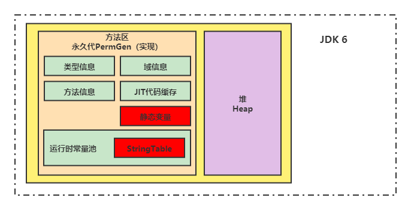

JDK1.7 ，有永久代，但已经逐步“去永久代”，字符串常量池，静态变量移除，保存在堆中。
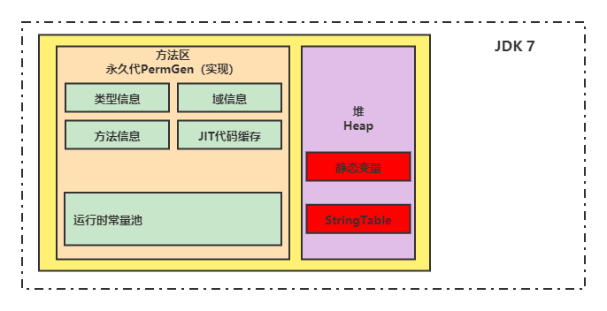

JDK1.8及以后，无永久代，类型信息、字段、方法、常量保存在本地内存的元空间，**但是字符串常量池、静态变量仍在堆。**


随着Java8的到来，Hotspot VM中再也见不到永久代了。但是这并不意味着类的元数据信息也小时了。这些数据被移到一个与堆不相连的本地内存区域，这个区域叫做元空间（Metaspace）。由于类的元数据分配在本地内存中，元空间的最大可分配空间就是系统可用内存空间。

**改动的原因：**

1. 为永久代设置控件大小是很难确定的。

   在某些场景下，如果动态加载过多，容易产生Perm区的OOM。比如某个实际Web工程中，因为功能点比较多，要不断动态加载很多类，经常出现致命错误。OutOfMemoryError:PermGen space。

   而元空间和永久代之间最大的区别在于元空间并不在虚拟机中，而是使用本地内存。因此默认情况下，元空间的大小仅受本地内存限制

2. 对永久代进行调优是很困难的。

   **方法区的垃圾收集主要回收两部分内容：常量池中废弃的常量和不再使用的类型。**

   Java虚拟机规范对方法区的约束是非常宽松的，提到过可以不要求虚拟机再方法区中实现垃圾收集。事实上也确实有未实现或未能完整实现方法区类型卸载的垃圾收集器存在（java 11的ZGC）

   一般来说这个区域的回收效果比较难令人满意，**尤其是类型的卸载，条件相当苛刻**。但是这部分区域的回收有时又确实是必要的。以前Sun公司的Bug列表中，曾出现过的若干个严重的Bug就是由于低版本的Hotspot虚拟机对此区域未完全回收而导致内存泄漏。

   判定一个常量是否“废弃”还是相对简单，而要判定一个类型是否属于“不再被使用的类”的条件就比较苛刻了。需要同时满足三个条件

   1. 该类所有的实例都已经被回收，也就是Java堆中不存在该类及其任何派生子类的实例。
   2. 加载该类的类加载器已经被回收，这个条件除非是经过精心设计的可替换类加载器的场景，如OSGI、JSP的重加载等，否则通常是很难达成的。
   3. 该类对应的java.lang.Class对象北邮再任何地方被引用，无法在任何地方通过反射访问该类的方法。

   Java虚拟机被允许对满足上述三个条件的无用类进行回收，这里说的仅仅是“被允许”，而不是和对象一样，没有引用了就必然会回收。关于是否要对类型进行回收，Hotspot虚拟机提供了-Xnoclassgc参数进行控制，还可以使用-verbose:class以及-XX:+TraceClass-Loading、-XX:+TraceUnLoading查看类加载和卸载信息

   在大量使用反射、动态代理、CGLib等字节码框架，动态生成JSP以及OSGi这类频繁自定义类加载器的场景中，通常都需要Java虚拟机具备类型卸载的能力，以保证不会对方法区造成过大的内存压力。

**StringTable为什么要调整？**

JDK7中将StringTable放到了堆空间中。因为永久代的回收效率很低，在Full GC的时候才会触发。而Full GC是老年代的空间不足、永久代不足时才会触发。这就导致StringTable回收效率不高。而我们开发中会有大量的字符串被创建，回收效率低，导致永久代内存不足。放到堆里，能及时回收内存。


##### **1.3.5.6 方法区的垃圾回收**

方法区内常量池之中主要存放的两大类常量：字面量和符号引用。

字面量比较接近Java语言层次的常量概念，如文本字符串、被声明为final的常量值等。

而符号引用则属于编译原理方面的概念，包括下面三类常量：

1. 类和接口的全限定名
2. 字段的名称和描述
3. 方法的名称和描述

Hotspot虚拟机对常量池的回收策略是很明确的，只要常量池中的常量没有被任何地方引用，就可以被回收

回收废弃常量与回收Java堆中的对象非常类似。

判断一个常量是否“废弃”还是相对简单，而要判断一个类型是否属于“不再被使用的类”的条件就比较苛刻。需要同时满足以下三个条件：

1. 该类所有的实例都已经被回收，也就是Java堆中不存在该类及任何派生子类的实例。
2. 加载该类的类加载器已经被回收，这个条件除非是经过精心设计的可替换类加载器的场景，如OSGi，JSP的重加载等，否则通常是很难达成的。
3. 该类对应的java.lang.Class对象没有在任何地方被引用，无法在任何地方通过反射访问该类的方法。

Java虚拟机被允许对满足以上三个条件的无用类进行回收，但也仅仅只是“被允许”，而并不是和对象一样，没有引用了就必然会回收。关于是否要对类型进行回收，Hotspot虚拟机提供了-Xnoclassgc参数进行控制，还可以使用-verbose:class以及-XX:+TraceClass-Loading、-XX:+TraceClassUnLoading查看类加载和卸载信息

在大量使用反射、动态代理、CGLib等字节码框架，动态生成JSP以及OSGi这类频繁自定义类加载器的场景中，**通常都需要Java虚拟机具备类型卸载的能力，以保证不会对方法区造成过大的内存压力。**


### 1.4 相关面试题

百度：

​	说一下JVM内存模式，有哪些区，分别是干什么的

蚂蚁金服：

​	Java8的内存分代改进

​	JVM内存分哪几个区，每个区的作业是什么

​	JVM内存分布/内存结构？栈和堆的区别？堆的结构？为什么有两个survivor区？

​	Eden和survivor的比例分配

小米：

​	jvm内存分区，为什么要有新生代和老年代？

字节：

​	java的内存分区

​	讲讲jvm运行时数据区

​	什么时候对象会进老年代

京东

​	jvm的内存结构，Eden和survivor比例

​	jvm内存为什么要分为新生代，老年代，持久代。新生代中为什么要分为Eden和survivor

天猫

​	jvm内存模型以及分区，需要要详细到每个分区放什么

​	jvm的内存模型，java8做了什么修改

拼多多

​	jvm内存分为哪几个区，作用是什么

美团

​	jvm内存分配

​	jvm的永久代中会发生垃圾回收吗

​	jvm内存分区，为什么要有新生代和老年代


### 1.5 对象的实例化内存布局与访问定位

#### 1.5.1  **对象的实例化**

**对象的创建方式**

-  new 
- Class 的newInstance (反射的方式：只能调用空参的构造器，权限必须的public)
- Constructor的newInstance(XXX) （反射的方式，可以调用空参、带参的构造器、权限没有要求）
- 使用clone() （不调用任何构造器，当前类需要实现Cloneable接口，实现clone()）
- 使用反序列化（从文件中、从网络中获取一个对象的二进制流）
- 第三方库Objenesis

**对象的创建步骤**

- **判断对象对应的类是否加载、链接、初始化**

  虚拟机遇到一条new指令，首先去检查这个指令的参数是否在Metaspace的常量池中定位到一个类的符号引用，并检查这个符号引用所代表的类是否已经被加载、解析、初始化（即判断类元信息是否存在）。如果没有，那么在双亲委派模式下，使用当前类的加载器以ClassLoader+包名+类名为Key进行查找对应的.class文件。如果没有找到文件，则抛出ClassNotFoundException异常，如果找到，则进行加载，并生成对应的Class对象

- **为对象分配内存**

  首先计算对象占用空间da小，接着在队中划分一块内存给新对象。如果实例成员变量是引用变量，仅分配引用变量空间即可，即4个字节大小。

  1. 如果内存规整的，那么虚拟机将采用指针碰撞法（Bump The Pointer）来为对象分配内存。意思是所有用过的内存在一百年，空闲的内存在另一边，中间存放一个指针作为分解点的指示器，分配内存就仅仅是把指针向空闲那边挪动一段与对象大小相等的距离罢了。如果垃圾收集器选择的是Serial、Parnew这种基于压缩算法的，虚拟机采用这种分配方式。一般使用带有compact（整理）过程的收集器时，使用指针碰撞。

  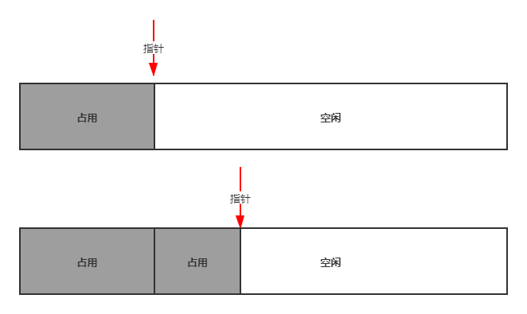


  2. 如果内存不规整的，已使用的内存和未使用的内存相互交错，那么虚拟机将采用空闲列表来为对象分配内存。意思是虚拟机维护一个列表，记录那些内存块是可用的，再分配的时候从列表中找到一块足够的的空间划分给对象实例，并更新列表上的内容。这种分配方式称为“空闲列表（Free List）”

  3. 选择哪种分配方式由Java堆是否规整决定，而Java堆是否规整又由所采用的垃圾收集器是否带有压缩整理功能决定

- **处理并发安全问题**

  - 采用CAS失败重试，区域加锁保证更新的原子性
  - 每个线程预先分配一块TLAB-->通过-XX:+/-UseTLAB参数设定

- **初始化分配到的空间（默认初始化）**

  所有属性设置默认值，保证对象实例字段在不赋值时可以直接使用

- **设置对象的对象头**

  将对象的所属类（即类的元数据信息）、对象的HashCode和对象的GC信息、锁信息等数据存储在对象的对象头中。这个过程的具体设置方式取决于JVM实现

- **执行 init方法进行初始化（显示初始化）**

  在Java程序的视角来看，初始化才正式开始。初始化成员变量，执行实例化代码块，调用类的构造方法，并把对内对象的首地址赋值给引用变量。因此一般来说（由字节码中是否跟随有invokespecial指令所决定），new指令之后会接着就是执行方法，把对象按照程序员的意愿进行初始化，这样一个真正可用的对象才算完全创建出来。

  

#### 1.5.2  **对象的内存布局**

- 对象头

  包含两部分

  - 运行时元数据（Mark Word）包含：**哈希值，GC分代年龄，锁状态标志，线程持有的锁，偏向线程ID，偏向时间戳**
  - 类型指针：指向类元数据InstanceKlass,确定该对象所属的类型

  如果是数组，还需要记录数组的长度

- 实例数据（Instance Data）

  它是对象正真存储的有效信息，包括程序代码中定义的各种类型的字段（包括从父类继承下来的和本身拥有的字段）

  相同宽度的字段总是分配在一起，父类中定义的变量会出现在子类之前，如果CompactFields参数为true（默认false），子类的窄变量可能插入到父类变量的空隙

- 对其填充（Padding）

  不是必须的，也没有特别含义，仅仅起到占位符的作用

**代码图解**

```java
class Account {
    
}
public class Customer {
    int id = 1001;
    String name;
    Account acct;
    
    {
        name = "匿名客户";
    }
    
    public Customer() {
        acct = new Account();
    }
}

public class Demo {
    public static void main(String[] args) {
        Customer cus = new Customer();
    }
}

```

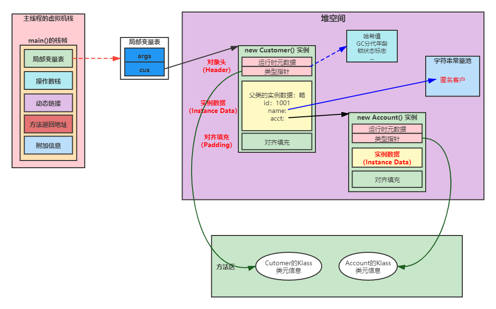

<center style="font-size:18px;color:#1E90FF">图33.对象内存布局图解</center>

#### 1.5.3  **对象的的访问定位**

创建对象的目的就是为了使用它，JVM是如何通过栈帧中的对象引用访问到其内部的对象实例的？

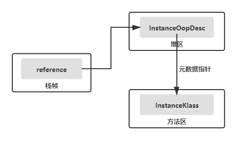

<center style="font-size:18px;color:#1E90FF">图34.对象访问定位</center>

**对象访问方式主要有两种**

- **句柄访问**
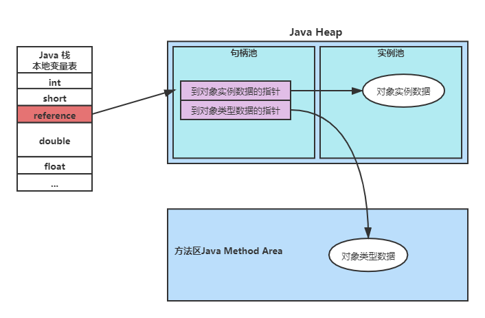
  - 实现：栈的本地变量表记录了对象引用reference,在堆空间开辟了一块区域，这块区域叫句柄池，放了很多的句柄，一个对象对应一个句柄，句柄有两个信息，一个是到对象实例数据的指针指向了堆空间中new的对象数据，一个是到对象类型数据的指针指向了方法区中对象的类元数据。
  - 好处：reference中存储稳定句柄地址，对象被移动（垃圾收集时移动对象很普遍）时只会改变句柄中实例数据指针即可，reference本身不需要被修改
  - 缺点：首先需要专门消耗一部分的空间用来存放句柄，其次要访问一个对象，要先找到这个引用的句柄，再通过句柄对应的指针访问对象实例，效率较低。
- **直接指针（Hotspot采用）**

  - 栈空间的对象指针直接指向了对象的实体，在对象实体当中有一个类型指针指向了方法区中对象的类元数据
  - 好处：直接通过对象引用就访问到对象，效率较高，也无需开辟新的空间。节省空间，速度快
  - 缺点：对象变动时，需要修改栈空间中的引用值


### 1.6 直接内存（Direct Memory）

直接内存不是虚拟机运行时数据区的一部分，也不是Java虚拟机规范中定义的内存区域

直接内存是Java堆外的、直接向系统申请的内存空间

来源于NIO，通过存在队中的DirectByteBuffer操作本地（Native）内存

通常，访问直接内存的速度会优于Java堆。即读写性能高。

读写文件，需要与磁盘交互，需要由用户态切换到内核态。在内核态时，需要内存如下图操作。使用IO，这里需要两份内存存储重复数据，效率低。
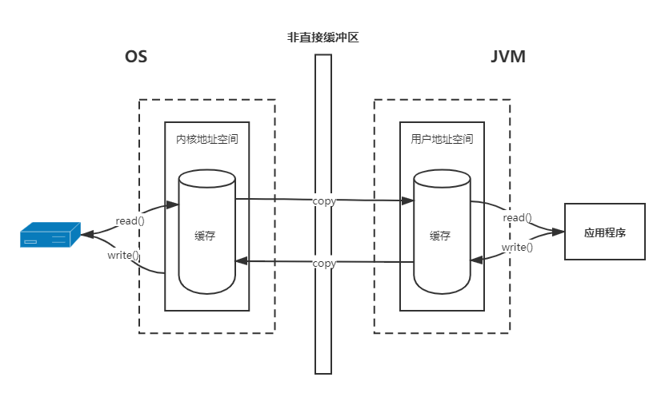

使用NIO时，操作系统划出的直接缓存区可以被java代码直接访问，只有一份。NIO适合对大文件的读写操作。


因此出于性能考虑，独写频繁的场合可能会考虑使用直接内存。Java的NIO库允许Java程序使用直接内存，用于数据缓冲区。

直接内存也可能导致OutOfMemoryError异常

由于直接内存在Java堆外，因此它的大小不会直接受限于-Xmx指定的最大堆大小，但是系统内存是有限的，Java堆和直接内存的总和依然受限于操作系统能给出的最大内存。

**缺点是分配回收成本较高，不受JVM内存回收管理**

直接内存大小可以通过MaxDirectMemorySize设置，如果不指定，默认于堆的最大值-Xmx参数一致


### 1.7 本地方法接口和本地方法库

#### 1.7.1  **本地方法**

简单地讲，**一个Native Method就是一个Java调用非Java代码的接口**。一个Native Method是这样一个Java方法：该方法的实现由非Java语言实现，比如C。这个特征并非Java所特有，很多其他的编程语言都有这一机制，比如在C++中，你可以用extern "C"告知C++编译器去调用一个C的函数。在定义一个native method时，并不提供实现体（有点像定义一个Java Interface），因为其实现体是由非Java语言在外面实现的。**本地接口的作用是融合不同的编程语言为Java所用，它的初衷是融合C/C++程序。**


**为什么要使用Native Method ？**

- **与Java环境外交互**

  Java使用起来非常方便，然而有些层次的任务用Java实现起来不容易，或者我们对程序的效率很在意时，问题就来了。**有时Java应用需要与Java外面的环境交互，这是本地方法存在的主要原因**。可以想想Java需要与一些底层系统，如操作系统或某些硬件交换信息时的情况。本地方法正是这样一种交流机制：它为我们提供了一个非常简洁的接口，而且我们无需去了解Java应用之外的繁琐细节。

- **与操作系统交互**

  JVM支持着Java语言本身的运行时库，它是Java程序赖以生存的平台，它由一个解释器（解释字节码）和一些连接到本地代码的库组成。然而不管怎样，它毕竟不是一个完整的系统，它经常依赖于一些底层系统的支持。这些底层系统常常是强大的操作系统**。通过使用本地方法，我们得以用Java实现了jre的与底层系统的交互，甚至JVM的一些部分就是C写的**。还有，如果我们要使用一些Java语言本身没有提供封装的操作系统的特性时，我们也需要使用本地方法。

- **Sun‘s Java**

  **Sun的解释器是用C实现的，这使得它像一些普通的C一样与外部交互。**jre大部分是用Java实现的，它也通过一些本地方法与外界交互。例如：java.lang.Thread的setPriority()方法是用Java实现的，但是它实现调用的是该类里的本地方法setPriority0()。这个方法是C实现的，并被植入JVM内部,在Windows 95的平台上，这个本地方法最终将调用Win32 SetPriority（）API。这是一个本地方法的具体实现由JVM直接提供，更多的情况是本地方法由外部的动态链接库提供，然后被JVM调用。


### 1.8 执行引擎

执行引擎是Java虚拟机核心的组成部分之一。“虚拟机”是一个相对于“物理机”的概念，这两种机器都有代码执行能力，其区别是物理机的执行引擎是直接建立在处理器、缓存、指令集和操作系统层面上的，**而虚拟机的执行引擎则是由软件自行实现的**，因此可以不受物理条件制约地定制指令集与执行引擎的结构体系，**能够执行那些不被硬件直接支持的指令集格式。**

JVM的主要任务是负责装载字节码到其内部，但字节码并不能够直接运行在操作系统之上 ，因为字节码指令并非等价于本地机器指令，它内部包含的仅仅只是一些能够被JVM所识别的字节码指令、符号表以及其他辅组信息。那么，如果要让一个Java程序运行起来，执行引擎的任务就是将字节码指令解释/编译为对应平台上的本地机器指令才可以。简单来说，JVM中的执行引擎充当了将高级语言翻译为机器语言的译者。
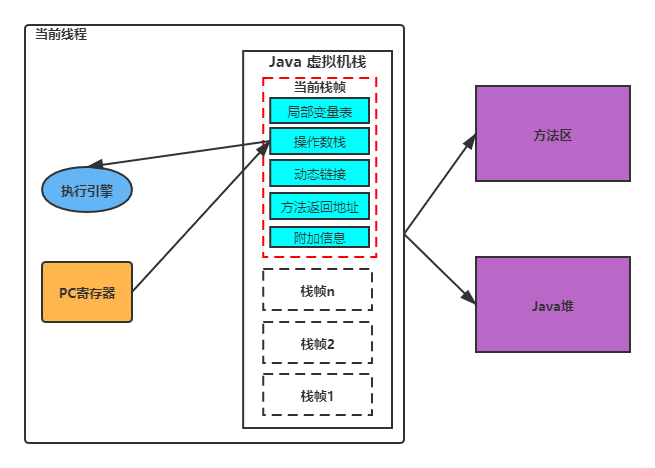

1） 执行引擎在执行的过程中究竟需要执行什么样的字节码指令完全依赖于PC寄存器

2） 每当执行完一项指令操作之后，PC寄存器就会更新下一条需要被执行的指令地址。

3） 当然方法在执行的过程中，执行引擎有可能会通过存储在局部变量表中的对象引用准确定位到存储在Java堆区中国的对象实例信息，以及通过对对象头中的元数据指针定位到目标对象的类型信息

从外观上来看，所有的Java虚拟机的执行引擎输入、输出都是一致的：输入的是字节码二进制流，处理过程是字节码解析执行的等效过程，输出的是执行结果。


大部分的程序代码转换成物理机的目标代码或虚拟机能执行的指令集之前，都需要经过上图的各个步骤。

Java代码编译是由Java源码编译器来完成的，流程图如下：


Java字节码的执行是由JVM执行引擎来完成，流程图如下：


**什么是解释器（Interpret）,什么是JIT编译器？**

解释器：当Java虚拟机启动时会根据预定义的规范**对字节码采用逐行解释的方式执行**，将每条字节码文件中的内容“翻译”为对应平台的本地机器指令执行。

JIT（Just In Time Compiler）编译器：就是虚拟机将源代码直接百年已成和本地机器平台相关的机器语言。

**为什么说Java是半编译半解释型语言？**

JDK1.0时代，将Java定位为“解释执行”还是比较准确的。再后来，Java也发展出可以直接生成本地代码的编译器。

现在JVM在执行Java代码的时候，通常会将解释执行由于编译执行二者结合起来进行。


### 1.9 StringTable
#### 1.9.1  **String的基本特性**

String:字符串，使用一对“”引起来表示。

String类声明为final的，不可被继承

String实现了Serializable接口，表示字符串是支持序列化的。实现了Comparable接口，表示String可以比较大小

String在JDK8以及以前内部定义了final char[] value 用于存储字符串数据。jdk9时改为byte[]

String代表不可变的字符序列，简称不可变性

1. 当对字符串重新赋值时，需要重写指定内存区域赋值，不能使用原有的value进行赋值。
2. 当对现有的字符串进行连接操作时，也需要重新指定内存区域赋值，不能使用原有的value进行赋值
3. 当调用String的replace()方法修改指定字符或字符串时，也需要重新制定内存区域赋值，不能使用原有value进行赋值

通过字面量的方式（区别于new）给一个字符串赋值，此时的字符串值声明在字符串常量池中。

```java
public class StringTest {
    @Test
    public void test() {
        String s1 = "abc"; // 字面量定义的方式，“abc”存储在字符串常量池中
        String s2 = "abc";
        System.out.println(s1 == s2); // 判断地址：true s1、s2都是取得常量池中的“abc”
        s1 = "hello";
        System.out.println(s1 == s2); // 判断地址：false s2现在指向的是常量池中的“hello”
        System.out.println(s1); // hello
        System.out.println(s2); // abc
    }
    
    @Test
    public void test1() {
        String s1 = "abc"; // 字面量定义的方式，“abc”存储在字符串常量池中
        String s2 = "abc";
        s2 += "def"; 
        System.out.println(s1); // abc 
        System.out.println(s2); // abcdef
    }
    
    @Test
    public void test2() {
        String s1 = "abc"; // 字面量定义的方式，“abc”存储在字符串常量池中
        s2 = s1.replace('a','m'); // 不可变性
        System.out.println(s1); // abc 
        System.out.println(s2); // mbc
    }
}

public Class StringExer {
    String str = new String("good");
    char[] ch = {'t','e','s','t'};
    
    public void change(String str,char ch[]) {
        str = "test ok";
        char[0] = 'b';
    }
    
    public static void main(String[] args) {
        StringExer ex = new StringExer();
        ex.change(ex.str,ex.ch);
        System.out.println(ex.str);// abc
        System.out.println(ex.ch); // best
    }
}
```

字符串常量池中是不会存储相同内容的字符串的

String的StringPool是一个固定大小的Hashtable，默认值大小长度是1009。如果放进String Pool的String非常多，就会造成Hash冲突严重，从而导致链表会很长，而链表长了后直接会造成的影响就是当调用String.intern时性能大幅下降

使用-XX:StringTableSize可设置StringTable的长度

在jdk6中StringTable是固定的，就是1009长度，所以如果常量池中的字符串过多就会导致效率下降很快。StringTableSize设置没有要求

在jdk7中，StringTable的默认长度是60013，1009是可设置的最小值。


#### 1.9.2  **String的内存分配**

在Java语言中有8种基本数据类型和一种比较特殊的类型String。这些类型为了使它们在运行过程中速度更快、更节省内存，都提供了一种常量池的概念。

常量池就类型一个Java系统级别提供的缓存。8种基本数据类型的常量池都是系统协调的，**String类型的常量池比较特殊。它的主要使用方法有两种。**

1. 直接使用双引号声明出来的String对象会直接存储在常量池中。比如String info = "abc";
2. 如果不是用双引号声明的String对象，可以使用String提供的intern()方法。

JDK6及之前，字符串常量池存放在永久代。

JDK7中Oracle的工程师对字符串池的逻辑做了很大的改变，即**将字符串常量池的位置调整到了Java堆内**。

1. 所有的字符串都保存在堆中，和其他普通对象一样，这样可以让你在进行调优应用时仅需要调整堆大小就可以了。

JDK8元空间，字符串常量在堆。

**StringTable调整的原因**：

1. permSize默认比较小。

 	2. 2. 永久代垃圾回收频率低。

#### 1.9.3  **字符串拼接操作**

1. 常量与常量的拼接结果在常量池，原理是编译期优化
2. 常量池中不会存在相同内容的常量
3. 只要其中有一个是变量，结果就在堆中。变量拼接的原理是StringBuilder
4. 如果拼接的结果调用intern()方法，则主动将常量池中还没有的字符串对象放入池中，并返回此对象地址。

```java
public class Demo {
    public void test() {
        String s1 = "javaEE";
        String s2 = "hadoop";
        String s3 = "javaEEHadoop";
        String s4 = "javaEE" + "hadoop";  // 编译器优化：等价于 "javaEEhadoop" 放到常量池中
        
        // 如果拼接符号的前后出现了变量，则相当于在堆空间中 new String()，具体内容为拼接的结果 
        String s5 = s1 + "hadoop"; 
        String s6 = "javaEE" + s2;
        String s7 = s1 + s2;
        // s1 + s2 底层实际执行细节（从字节码文件分析）
        // ① StringBuilder s = new StringBuilder();
        // ② s.append("javaEE")
        // ③ s.append("hadoop")
        // ④ s.toString() --> 约等于 new String("javaEEhadoop")此时new的字符串是放在堆空间中的，不是放到常量池里
        
        System.out.println(s3==s4); // true
        System.out.println(s3==s5); // false 
        System.out.println(s3==s6); // false 
        System.out.println(s3==s7); // false 
        System.out.println(s5==s6); // false 
        System.out.println(s5==s7); // false 
        System.out.println(s6==s7); // false 
        // intern(): 判断字符串常量池中是否存在javaEEhadoop值，如果存在，则返回常量池中javaEEhadoop的地址；
        // 如果不存在javaEEhadoop,则在常量池中加载一份javaEEhadoop，并返回此对象的地址
        String s8 = s6.intern();
        System.out.println(s3==s8); // true
    }
    
    public void test1() {
        // 字符串拼接操作不一定使用的是StringBuilder。如果拼接符号左右两边都是字符串常量或者常量引用，则仍然使用编译期优化。
        // 针对于final修饰类、方法、基本数据类型、、引用数据类型，能使用上建议就用上。
        final String s1 = "a";
        final String s2 = "b";
        String s3 = "ab";
        String s4 = s1 + s2;
        System.out.println(s3 == s4); // true
    }
}
```

String 变量添加与StringBuilder效率对比

```java
public class Demo {
    // cos: 4470ms
    public void m1 {
        String str = "";
        for(int i = 0; i < highLevel; i++) {
            str = str + "a"; // 每次都会创建一个StringBuilder，String
        }
    }
    
    // cos : 7ms
    public void m2 {
        // 只需要创建一个StringBuilder,还有改进空间：如果字符串长度是确定小于某个highLevel的，可以创建new StringBuilder(highLevel)；
        // 减少数组扩容时产生多余的对象
        StringBuilder str = new StringBuilder();
        for(int i = 0; i < highLevel; i++) {
            str.append("a");
        }
    }
}
```

#### 1.9.5  **intern()的使用**

如果不是用双引号声明的String对象，可以使用String提供的intern方法；intern方法会从字符串常量池中查询当前字符串是否存在，若不存在就会将当前字符串放入常量池中，若存在则返回常量池中的对象。比如：String str = new String("hello").intern(); 也就是说，如果在任意字符串上调用String.intern方法，那么其返回结果所指向的那个类实例，必须和直接以常量形式出现的字符串实例完全相同。因此，表达式（"a" +"b"+"c").intern()  == "abc" 的值必为true；通俗点讲，Interned String就是确保字符串在内存里只有一份拷贝，这样可以节约内存空间，加快字符串操作任务的执行速度。注意这个值会被存放在字符串内部池（String Intern Pool）

**new String("ab") 到底创建了几个对象？new String("a") + new String("b") 又创建了几个对象？ **

```java
public class Demo {
    public static void main(String[] args) {
        String s = new String("1");
        s.intern();
        String s2 = "1";
        System.out.println(s == s2); // 
        
        String s3 = new String("1") + new String("1");
        s3.intern();
        String s4 = "11";
        System.out.println(s3 == s4);// 
    }
}
```


#### 1.9.6  **StringTable的垃圾回收**
#### 1.9.7  **G1中的String去重操作**


## 2. 垃圾回收

## 3. 字节码与类的加载

## 4. 性能监控与调优
