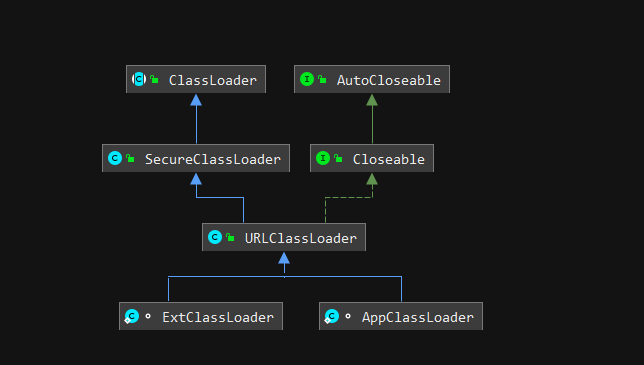
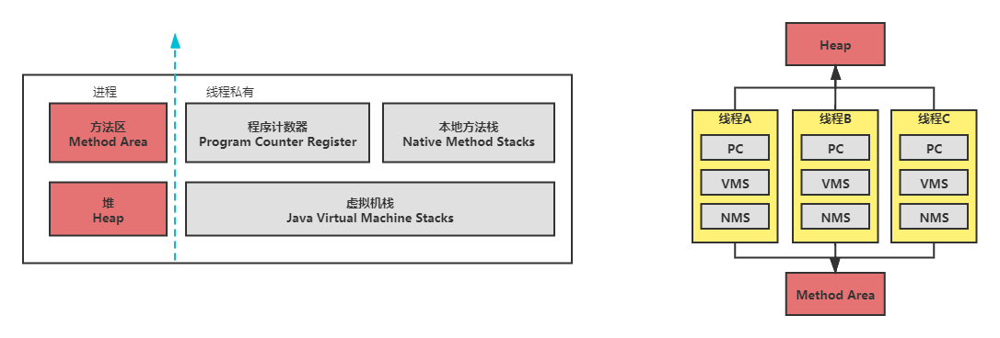
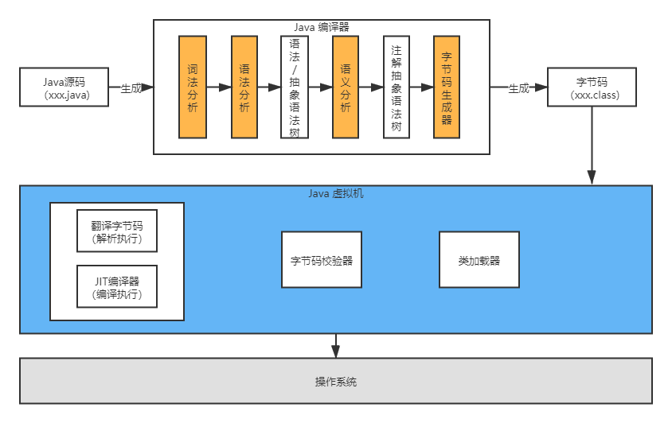
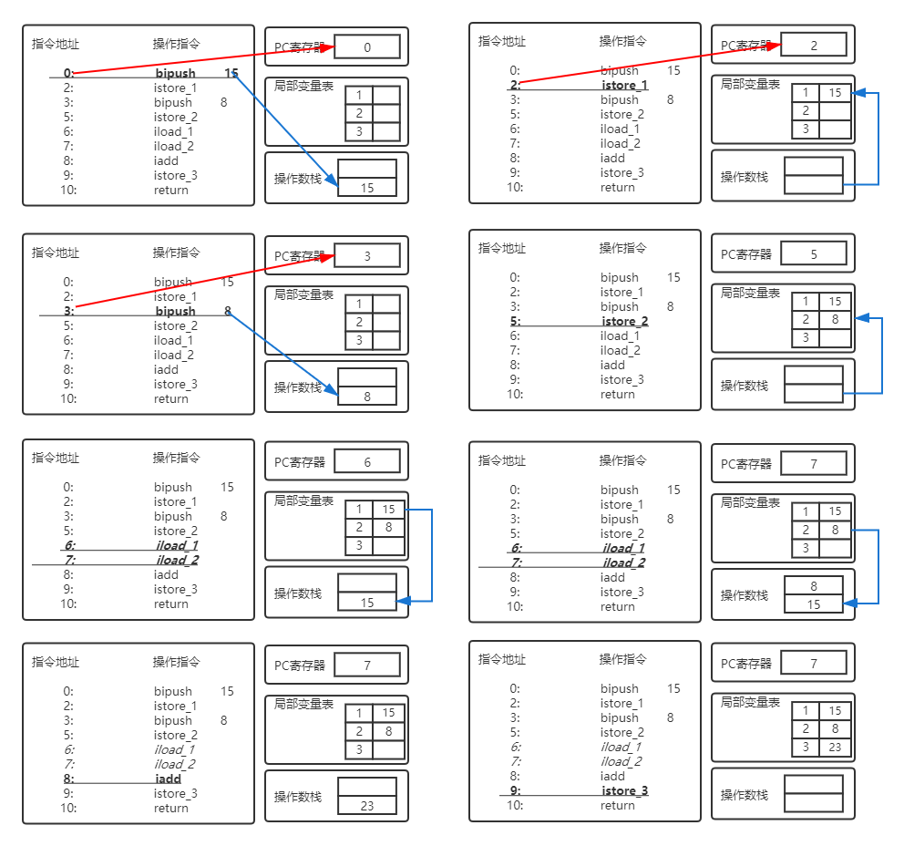

# JVM 知识

## 1. 内存结构

### 1.1 内存结构概览


  <center style="font-size:18px;color:#1E90FF">图1.内存结构简图</center> 


  <center style="font-size:18px;color:#1E90FF">图2.内存结构详细图</center> 

### 1.2 类加载子系统


  <center style="font-size:18px;color:#1E90FF">图3.类加载子系统</center>

负责从文件系统或者网络中加载Class文件,class文件在文件开头有特定的文件标识

类加载器(Class Loader)只负责class文件的加载,至于它是否可以运行,由执行引擎(Execution Engine)决定。

加载的**类信息**存放于一块称为**方法区**的内存空间。 除了类信息之外，方法区中还会存放**运行时常量池信息**，可能还包括字符串字面量和数字常量（这部分常量信息是class文件中常量池部分的内存映射）

- **加载（Loading）**

    1. 通过一个类的全限定名获取定义此类的二进制字节流
    2. 将这个字节流所代表的静态存储结构转化为方法区的运行时数据结构
    3. **在内存中生成一个代表这个类的java.lang.Class对象**，作为方法区这个类的各种数据的访问入口

- **链接（Linking）**

    1. 验证(Verify):

       主要包含四种验证, **文件格式验证，元数据验证，字节码验证，符号引用验证**。

       目的在于确保class文件的字节流中包含信息符合当前虚拟机要求，保证被加载类的正确性，不会危害虚拟机自身安全。

    2. 准备(Prepare):

       为**类变量**分配内存并设置该类变量的**默认初始值，即零值**。

       ```java
       public class Demo{
           private static int a = 1; // 此阶段(prepare): a = 0 
           // Initialization阶段才赋值 a = 1
       }
       ```

       ***这里不包含用final修饰的static，因为final修饰此时是个常量，final在编译的时候就会分配了，准备阶段会显示初始化***

       这里不会为实例变量分配初始化值，类变量会分配在方法区中，而实例变量是会随着对象一起分配到java堆中。

    3. 解析(Resolve):

       **将常量池内的符号引用转换为直接引用的过程。**

       **事实上，解析操作往往会伴随着jvm在执行完初始化之后再执行。**

       符号引用就是一组符号来描述所引用的目标。符号引用的字面量形式明确定义在《java虚拟机规范》的class文件格式中。直接引用就是直接指向目标的指针、相对偏移量或者一个间接定位到目标的句柄。

       解析动作主要针对类或者接口、字段、类方法、接口方法、方法类型等。对常量池中的CONSTANT_ClASS_INFO、CONSTANT_FIELDREF_INFO、CONSTANT_METHODREF_INFO等。

- **初始化(Initialization)**

  初始化阶段就是执行类构造器方法<clinit>()的过程。

  此方法不需要定义，是javac编译器**自动收集**类中的**所有类变量的赋值动作和静态代码块中的语句**合并而来的。

  构造方法中指令按语句在源文件中出现的顺序执行。

  ```java
  	public class Demo {
          private static int num = 1;
          static {
              num = 2;
              number = 20;
          }
          private static int number = 10; // 链接(linking)的prepare阶段： number = 0; initial阶段: 先20再10, 最终 number=10; 
      }
  ```

  <clinit>() 不同于类的构造器。（关联：构造器是虚拟机视角下的<init>())

  若该类具有父类，JVM会保证字类的<clinit>()执行之前，父类的<clinit>()已经执行完毕。

  **虚拟机必须保证一个类的<clinit>() 方法在多线程下被同步加锁**。

#### 1.2.1 类加载器

从jvm角度，类加载器分为两种类型

1. 引导类（启动类）加载器(Bootstrap ClassLoader) （Native代码C++语言实现的）
2. 其他加载器(所有派生于抽象类ClassLoader的类加载器)（Java 实现的）



  <center style="font-size:18px;color:#1E90FF">图4.ClassLoader类图</center>

从开发角度分为4种

1. 引导类（启动类）加载器BootstrapClassLoader
2. 拓展类加载器ExtensionClassLoader（ExcClassLoader）
3. 系统类加载器SystemClassLoader（AppClassLoader）
4. 自定义加载器


<center style="font-size:18px;color:#1E90FF">图5.类加载器</center>

   这里的四者之间的关系是**组合关系**（包含）。而不是父子继承关系。例如一各文件夹/a/b/c.txt，c的上一级是b，b的上一级是a，但是不能说a、b、c之间是一种继承关系，或者可以这样理解，类的加载器是具有等级制度的，等级跟等级之间可以理解为上下级也行，但是不能理解为继承关系。

根据一下代码简单理解下类加载器之间的层级关系

```java
public class ClassLoaderDemo {
    public static void main(String[] args) {
        // 获取系统类加载器
        ClassLoader systemClassLoader = ClassLoader.getSystemClassLoader();
        System.out.println(systemClassLoader);

        // 获取其上一级： 扩展类加载器
        ClassLoader extClassLoader = systemClassLoader.getParent();
        System.out.println(extClassLoader);

        // 获取其上一级：获取不到引导类加载器
        ClassLoader bootstrapClassLoader = extClassLoader.getParent();
        System.out.println(bootstrapClassLoader);

        // 获取用户自定义类的类加载器
        ClassLoader classLoader = ClassLoaderDemo.class.getClassLoader();
        System.out.println(classLoader);

        // 获取java类库Strin类的类加载器
        ClassLoader classLoader1 = String.class.getClassLoader();
        System.out.println(classLoader1);
    }
}

/** 结果
sun.misc.Launcher$AppClassLoader@18b4aac2
sun.misc.Launcher$ExtClassLoader@74a14482
null
sun.misc.Launcher$AppClassLoader@18b4aac2
null

第一行返回了一个系统类加载器
第二行返回说明了拓展类加载器为系统类加载器的上层
第三行返回结果为空，获取不到引动类加载器bootstrapclassloader，因为bootstrapclassloader是native(c++)语言编写的
第一行和第四行结果说明用户自定义的类默认使用的是系统类加载器进行加载的
第三行和第五行结果说明Java的核心类库都是使用引导类加载器(bootstrapclassloader)进行加载的
*/
```

无论类加载器的类型如何划分，在程序中我们最常见的类加载器始终只有3个。

- **启动类加载器（Bootstrap ClassLoader）**
  - 这个类加载器使用C/C++语言实现的，嵌套在JVM内部
  - 它用来加载Java的核心类库（JAVA_HOME/jre/lib/rt.jar、resources.jar或sun.boot.class.path路径下的内容），用于提供JVM自身需要的类
  - 并不继承自java.lang.ClassLoader，没有父类加载器（C++实现的肯定不可能再去继承java的体系结构了）
  - 加载拓展类和应用类加载器，并指定为他们的父类加载器
  - 出于安全考虑，BootstrapClassLoader只加载包名为java、javax、sun等开头的类
- **拓展类加载器（Extension ClassLoader）**
  - java语言编写，有sun.misc.Launcher$ExtClassLoader实现。（Launcher的内部类）
  - 派生于ClassLoader类
  - 父类加载器为启动类加载器（BootstrapClassLoader）
  - 从java.ext.dirs系统属性所指定的目录中加载类库，或从JAVA_HOME/jre/lib/ext目录下加载类库。**如果用户创建的JAR放在此目录下，也会自动由拓展类加载器加载**
- **应用程序加载器（系统类加载器，AppClassLoader）**
  - java语言编写，有sun.misc.Launcher$AppClassLoader实现。（Launcher的内部类）
  - 派生于ClassLoader类
  - 父类加载器为启动类加载器（BootstrapClassLoader）
  - 它负责加载环境变量classpath或者系统属性java.class.path指定路径下的类库
  - **该类加载器是程序中默认的类加载器**，一般来说，Java应用的类都是由它来完成加载
  - 通过ClassLoader#getSystemClassLoader()方法可以获取到该类加载器


#### 1.2.2  **ClassLoader类**

ClassLoader类，它是一个抽象类，其后所有的类加载器都继承自ClassLoader（不包括启动类加载器BootstrapClassLoader）

ClassLoader主要方法

| 方法名称                                             | 描述                                                         |
| ---------------------------------------------------- | ------------------------------------------------------------ |
| loadClass(String name)                               | 加载名称为name的类，返回结果为java.lang.Class类的实例        |
| findClass(String name)                               | 查找名称为name的类，返回结果为java.lang.Class类的实例        |
| findLoaded(String name)                              | 查找名为name的已经被加载过的类，返回结果为java.lang.Class类的实例 |
| defineClass(String name, byte[] b, int off, int len) | 把字节数组b中的内容转换为一个Java类，返回结果为java.lang.Class类的实例 |
| resovleClass(Class<?> c)                             | 连接指定的一个java类                                         |
| getParent()                                          | 返回该类加载器的超类加载器                                   |

几种获取ClassLoader的途径

```javascript
// 方式1. 获取当前类的ClassLoader
clazz.getClassLoader()
example:
	Class.forName("java.lang.String").getClassLoader();
// 方式2. 获取当前线程上下文的ClassLoader
Thread.currentThread().getContextClassLoader()
// 方式3. 获取系统的ClassLoader
ClassLoader.getSystemClassLoader()
// 方式4. 获取调用者的ClassLoader
DriverManager.getCallerClassLoader()
```


#### 1.2.3  **双亲委派机制**

Java虚拟机对class文件采用的是**按需加载**的方式，依旧是说当需要使用该类时才会将它的class文件加载到内存生成class对象。而且加载某个类的class文件时，java虚拟机采用的是双亲委派模式，即把请求交由父类处理，它是一种任务委派模式。

**工作原理：**

1. 如果一个类加载器收到了类加载请求，它并不会自己先去加载，而是把这个请求委托给父类的加载器去执行

2. 如果父类的加载器还存在其父类加载器，则进一步向上委托，依次递归，请求最终将到达顶层的启动类加载器

3. 如果父类加载器可以完成类加载任务，就成功返回，倘若父类加载器无法完成此加载任务，子类加载器才会尝试自己去加载，这就是双亲委派模式。

   
   
   <center style="font-size:18px;color:#1E90FF">图6.双亲委派</center>

代码示例理解:

```java
// 在src下自己创建一个java.lang包，创建一个String类
package java.lang;

public class String {
    static {
        System.out.println("自定义String类静态方法");
    }
}
```

```java
package org.example;

public class StringTest {
    public static void main(String[] args) {
        String str = new java.lang.String();
        System.out.println("hello world");
        
        StringTest test = new StringTest();
        System.out.println(test.getClass().getClassLoader());
    }
}

/** 结果
hello world
sun.misc.Launcher$AppClassLoader@18b4aac2

从结果来看,静态代码块没有被执行，说明String并没有加载自己定义的String类。
而是加载了java核心类库定义的String类。由此说明当加载String时，一直向上委派，委派到BootstrapClassLoader时，
发现该类是以java.开头属于启动类加载器的加载范围，因此启动类加载器直接加载了java核心类库的String类。
而StringTest类向上委托时，BootstrapClassLoader和ExtensionClassLoader发现
StringTest不在他们的加载路径下，最终交由系统类加载器自己加载
*/
```

```java
// 在自定义java.lang包的String类种加入main方法
package java.lang;

public class String {
    static {
        System.out.println("自定义String类静态方法");
    }

    public static void main(String[] args) {
        System.out.println("hello,string");
    }
}

/** 结果
错误: 在类 java.lang.String 中找不到 main 方法, 请将 main 方法定义为:
   public static void main(String[] args)
否则 JavaFX 应用程序类必须扩展javafx.application.Application

从此结果来看，main方法执行时,此时需要加载Strin类，类在加载的时候根据双亲委派机制，加载了java核心类库的String类，核心类库中String是没有main方法的
因此此时去执行main方法，就会报错
*/
```

```java
package java.lang;

public class Demo {
    public static void main(String[] args) {
        System.out.println("hello, demo");
    }
}
/** 结果
Error: A JNI error has occurred, please check your installation and try again
Exception in thread "main" java.lang.SecurityException: Prohibited package name: java.lang
	at java.lang.ClassLoader.preDefineClass(ClassLoader.java:655)
	at java.lang.ClassLoader.defineClass(ClassLoader.java:754)
	at java.security.SecureClassLoader.defineClass(SecureClassLoader.java:142)
	at java.net.URLClassLoader.defineClass(URLClassLoader.java:468)
	at java.net.URLClassLoader.access$100(URLClassLoader.java:74)
	at java.net.URLClassLoader$1.run(URLClassLoader.java:369)
	at java.net.URLClassLoader$1.run(URLClassLoader.java:363)
	at java.security.AccessController.doPrivileged(Native Method)
	at java.net.URLClassLoader.findClass(URLClassLoader.java:362)
	at java.lang.ClassLoader.loadClass(ClassLoader.java:418)
	at sun.misc.Launcher$AppClassLoader.loadClass(Launcher.java:355)
	at java.lang.ClassLoader.loadClass(ClassLoader.java:351)
	at sun.launcher.LauncherHelper.checkAndLoadMain(LauncherHelper.java:601)

如果能被加载，那么可能会对引导类加载器造成印象，为了安全性和核心API被随意篡改，不允许用户自定义类使用核心api的包名命名
*/
```

**双亲委派的优势：**

- 避免类的重复加载
- 保护程序安全，防止核心API被随意篡改
  - 自定义类： java.lang.String
  - 自定义类： java.lang.Demo

**沙箱安全机制**

上述自定义String类时，会先使用BootstrapClassLoader进行加载，在加载过程中会先加载jdk自带的文件(rt.jar包中的java\lang\String.class), 报错信息说没有main方法，因为加载的是rt.jar包下的String类。这样可以保证对java核心源代码的安全保护，这就是沙箱安全机制。


#### 1.2.4  **其他**

**在jvm中表示两个class对象是否为同一个对象存在两个必要条件：**

1. 类的完整类名必须一致，包括包名。
2. 加载这个类的ClassLoader（指ClassLoader实例对象）必须相同

换句话说，在jvm中，即使这两个类对象（class对象）来源于同一个Class文件，被同一个虚拟机所加载，单只要加载它们的ClassLoader实例对象不同，那么这两个类对象也是不相等的。


jvm必须知道一个类型是由启动加载器加载的还是由其他类加载器加载的。

**如果一个类型是由其他类加载器加载的，那么jvm会将这个类加载器的一个引用作为类型信息的一部分保存在方法区中。**

当解析一个类型到另有一个类型的引用的时候，jvm需要保证这两个类型类加载器是相同的（不太理解时，学习动态链接）。


java程序对类的使用分为：主动使用（会初始化）和被动使用。

- 主动使用又分为七种

  - 创建类的实例
  - 访问某个类或接口的静态变量，或者对该静态变量赋值
  - 调用类的静态方法
  - 反射（比如 Class.forName(“xxx”)）
  - 初始化一个类的字类
  - Java虚拟机启动时被标记为启动类的类
  - JDK 7 开始提供的动态语言支持： java.lang.invoke.MethodHandle实例解析结果REF_getStatic、REF_putStatic、REF_invokeStatic句柄对应的类没有初始化，则初始化
- 除了以上7中，其他使用Java类的方法都是被看作是对类的被动使用，**都不会导致类的初始化**

### 1.3 运行时数据区


<center style="font-size:18px;color:#1E90FF">图7.数据加载图</center>

​	网络或者硬盘上的数据要被CPU计算，首先需要先加载到内存然后再经过CPU加载计算，内存是非常重要的系统资源，是CPU和硬盘的中间仓库及桥梁，承载着操作系统和应用程序的试试以运行。JVM内存布局规定了Java在运行过程中内存申请、分配、管理的策略，保证了JVM的高效率稳定运行。**不同的jvm对于内存的划分方式和管理机制存在着部分差异。**


<center style="font-size:18px;color:#1E90FF">图8.JDK8运行时数据区结构</center>

   JDK1.8将方法区替换成了元空间使用的是本地内存。

  Java虚拟机定义了若干种程序运行期间会使用到的运行时数据区，其中有一些会随着虚拟机启动而创建，随着虚拟机退出而销毁。另外一些则是与线程一一对应的，这些线程对应的数据区域会随着线程开始和结束而创建和销毁。因此分为线程私有区域和线程公用区域。

- 每个线程私有： 程序计算器，本地方法栈，虚拟机栈
- **线程间共享**： 堆、堆外内存（永久代或者元空间，代码缓存区）




<center style="font-size:18px;color:#1E90FF">图9.运行时数据区划分</center>

  **每个JVM只有一个Runtime实例。即为运行时环境，相当于内存结构的中间的那个框框：运行时环境（运行时数据区）。**

#### 1.3.1  **程序计数器（PC寄存器）**

JVM中的程序计数寄存器（Program Counter Register）中，Register的命名源于CPU的寄存器，寄存器存储指令相关的现场信息。CPU只有把数据装载到寄存器才能够运行。这里并非是广义上所指的物理寄存器，或许将其翻译为PC计数器（或指令计数器）会更加贴切（也成为程序钩子），并且不容易引起一些不必要的误会。**JVM中的PC寄存器是对物理PC寄存器的一种抽象模拟。**

**作用： PC寄存器用来存储指向下一条指令的地址，也即将要执行的指令代码。由执行引擎读取下一条指令。**


<center style="font-size:18px;color:#1E90FF">图10.PC寄存器</center>

1. 它是一块很小的内存空间，几乎可以忽略不记。也是运行速度最快的存储区域。
2. 在JVM规范中，每个线程都有自己的程序计数器，是线程私有的，生命周期与线程的生命周期保持一致。
3. 任何时间一个线程都只有一个 方法在执行官，也就是所谓的当前方法。程序计数器会存储当前线程正在执行的Java方法的JVM指令地址；或者，如果是在执行native方法，则是未指定值（undefined)。（因为这里指的是java层面的东西，调用C就显示不出来了）
4. 它是程序控制流的指示器，分支、循环、跳转、异常处理、线程恢复等基础功能都需要依赖这个计数器来完成。
5. 字节码解释器工作时就是通过改变这个计数器的值来选取下一条需要执行的字节码指令。
6. **它是唯一一个在Java虚拟机规范中没有规定任何OutOfMemeryError情况的区域。**


<center style="font-size:18px;color:#1E90FF">图11.PC寄存器示例图</center>

- **使用PC寄存器存储字节码指令地址有什么用？为什么使用PC寄存器记录当前线程的执行地址？**

  因为CPU需要不停的切换各个线程，这时候切换回来以后，就得知道接着从哪开始继续执行。JVM的字节码解释器就需要通过改变PC寄存器的值来明确下有一条应该执行什么样的字节码指令。

- **PC寄存器为什么会被设定为线程私有**

  所谓的多线程在有一个特定的时间段内只会执行其中某一个线程的方法，CPU会不停的做任务切换，这样必然导致经常中断或恢复，为了能够准确地记录各个线程正在执行的当前字节码指令地址，最好的办法自然是为每一个线程都分配一个PC寄存器，这样一来各个线程之间便可以进行独立计算，从而不会出现互相干扰的情况。
  
  

#### 1.3.2  **虚拟机栈**


<center style="font-size:18px;color:#1E90FF">图12.跨平台性</center>

Java具有跨平台性的。一次编译，多次执行。虽然各个平台的Java虚拟机内部实现细节不尽相同，但是他们共同执行的字节码内容却是一样的。



<center style="font-size:18px;color:#1E90FF">图13.代码执行流程</center>

Java编译器编译过程中，任何一个节点执行失败就会造成编译失败。

Java 虚拟机使用类加载器（Class Loader）加载class文件。类加载完成之后，会进行字节码校验，字节码校验通过后，JVM解释器会把字节码翻译成机器码（即：汇编语言）交由操作系统执行。

操作系统并不识别字节码指令，只能够识别机器指令，JVM的主要任务就是负责将字节码装载到其内部，解释/编译为对应平台的机器指令（即：汇编语言）执行


<center style="font-size:18px;color:#1E90FF">图14.语言翻译</center>

但不是所有代码都是解释执行的，JVM对此做了优化。比如，以Hotspot虚拟机来说，它本身提供了JIT(Just in Time)


##### **1.3.2.1 JVM的架构模型**

Java编译器输入的指令流基本上是一种**基于栈的指令集架构**，另外一种指令集架构则是**基于寄存器的指令集架构**。

- **基于栈式架构的特点：**
  - 设计和实现更简单，适用于资源受限的系统。
  - 避开了寄存器的分配难题：使用零地址指令方式分配。
  - 指令流中的指令大部分是零地址指令，其执行过程依赖于操作栈。指令集更小，编译器容易实现。
  - 不需要硬件支持，可以执行更好，更好实现跨平台。
- **基于寄存器架构的特点：**
  - 典型的应用是x86的二进制指令集：比如传统的PC以及Android的Davlik虚拟机。
  - 指令集架构则完全依赖硬件，可以执行差
  - 性能优秀和执行更高效。
  - 花费更少的指令去完成一项操作。
  - 在大部分情况下，基于寄存器架构的指令集往往都以一地址指令、二地址指令和三地址指令为主。

由于跨平台性的考虑，**Java的指令都是根据栈来设计的**。不同平台CPU架构不同，所以不能设计为基于寄存器的。栈式由于式基于内存，入栈出栈，不依赖硬件。有点是跨平台性，指令集小，编译器容易实现，缺点是性能 下降，实现同样的功能需要更多的指令。

**栈是运行时的单位，而堆是存储的单位。**即：栈解决程序的运行问题，即程序如何之心，或者说如何处理数据。堆解决的是数据存储的问题，即数据怎么放，放哪里。

Java虚拟机栈（Java Virtual Machine Stack)，早期也叫Java栈。每个线程在创建时都会创建一个虚拟机栈，其内部保存一个个的栈帧（Stack Frame）,对应一次次的方法调用。**Java虚拟机栈是线程私有的，生命周期和线程一致，主管Java进程的运行，它保存方法的局部变量，部分结果，并参与方法的调用和返回。**


**栈的特点：**

- 栈是一种快速有效的分配存储方式，访问速度仅次于程序计数器。
- JVM直接对Java栈的操作只有两个：
  - 每个方法执行，伴随着进栈（入栈、压栈）
  - 执行结束之后的出栈工作
- 对于栈来说，不存在垃圾回收问题。

**栈中可能出现的两个异常：**

- Java 虚拟机规范允许Java栈的大小是动态的或者是固定不变的（通过参数  **-Xss** [stack size]设置线程的最大栈空间，栈的大小直接决定了函数调用的最大可达深度, eg. -Xss 10m）。

  - 如果采用固定大小的Java虚拟机栈，那每一各线程的Java虚拟机栈容量可以在线程创建的时候独立选定。如果线程请求分配的栈容量超过虚拟机栈允许的最大容量，Java虚拟机将会抛出一个**StackOverflowError**异常。

    ```java
    // 栈溢出举例
    public class StackOverFlowDemo {
        public static void main(String[] args) {
            main(args);
        }
    }
    ```

    

  - 如果Java虚拟机栈可以动态扩展，并且在尝试拓展的时候无法申请到足够的内存，或者在创建新的线程时没有足够的内存区创建对应的虚拟机栈，那么Java虚拟机将会抛出一个**OutOfMemoryError**异常。

**栈中存储什么？**

每个线程都有自己的栈，栈中的数据都是以**栈帧(Stack Frame)**的格式存在。

在这个线程上正在执行的每个方法都各自对应一个栈帧。

栈帧是一个内存区块，是一个数据集，维系着方法执行过程中的 各种数据信息。

**栈运行原理**

JVM直接对栈的操作只有两个，就是对栈帧的**压栈**和**出栈**，遵循**“先进后出”/“后进先出”**原则。

在一条活动线程中，一个时间点上，只会有一个活动的栈帧。即只有当前正在执行的方法的栈帧（栈顶栈帧）是有效的，这个栈帧被称为**当前栈桢（Current Frame）**，与当前栈帧相对应的方法就是当前方法（Current Method），定义这个方法的类就是当前类（Current Class）

执行引擎运行的所有字节码指令只针对当前栈帧进行操作。如果在该方法中调用了其他方法，对应的新栈帧会被创建出来，放在栈的顶端，成为新的当前桢。


<center style="font-size:18px;color:#1E90FF">图15.方法与栈帧</center>

不同的线程中所包含的栈帧是不允许存在相互引用的，即不可能在一个栈帧之中引用另外一个线程的栈帧。

如果当前方法调用了其他方法，方法返回之际，当前栈帧会传回此方法的执行结果给前一个栈帧，接着，虚拟机会丢弃当前栈帧，使得前一个栈帧重新成为当前栈帧。Java方法有两种返回函数的方式，**一种是正常的函数返回，使用return指令。另一种是抛出异常。不管用哪种方式，都会导致栈帧被弹出。**


##### **1.3.2.2 栈帧的内部结构 **

- 局部变量表（Local Variables）
- 操作数栈（Operand Stack）（或表达式栈）
- 动态链接（Dynamic Linking）（或者指向运行时常量池的方法引用）
- 方法返回地址（Return Address）（或方法正常退出或者异常退出的定义）
- 一些附加信息


<center style="font-size:18px;color:#1E90FF">图16.栈帧内部结构</center>


##### **1.3.2.3 局部变量表**

- 局部变量表也被称之为局部变量数组或本地变量表。
- 为一个**数字数组**，主要用于存储**方法参数**和定义在**方法体内的局部变量**，这些数据类型包括各类基本数据类型、对象引用（reference），以及returnAddress类型。
- 由于局部变量表是建立在线程的栈上，是线程私有的数据，因此**不存在数据安全问题**。
- **局部变量表所需的容量大小是在编译器确定下来的**，并保存在方法的maximum local variable数据项中。在方法运行期间是不会改变局部变量表的大小的。
- **方法嵌套调用的次数由栈的大小决定。**一般来讲，**栈越大，方法嵌套调用次数越多**。对于一个函数而言它的参数和局部变量越多，使得局部变量表膨胀，它的栈帧就越大，以满足方法调用所需传递的信息增大的需求。进而函数调用就会占用更多的栈空间，导致其嵌套调用次数就会减少。
- **局部变量表中的变量只在当前方法调用中有效**。在方法执行时，虚拟机通过使用局部变量表完成参数值到参数变量列表的传递过程。**当方法调用结束后，随着方法栈帧的销毁，局部变量表也会随之销毁**。

- 局部变量表，最基本的存储单元是Slot（变量槽）
- 参数值的存放总是在局部变量数组的index0开始，到数组长度-1的索引结束。
- 局部变量表中存放编译期可知的各种基本数据类型（8种），引用类型（reference），returnAddress类型的变量
- 在局部变量表里，32位以内的类型只占用一个slot（包括returnAddress类型），64位类型（long和double）占用两个slot。
  - byte、short、char在存储前被转换位int，boolean也转换为int，0表示false，1表示true
  - long和double则占据两个slot
  


<center style="font-size:18px;color:#1E90FF">图17.slot理解</center>

- JVM会为局部变量表的每一个Slot都分配一个访问索引，通过这个索引即可成功访问到局部变量表中指定的局部变量

- 当一个实例方法被调用的时候，它的方法参数和方法体内部定义的局部变量将会**按照顺序**被复制到局部变量表中的每一个Slot上

- **如果需要访问局部变量表中一个64bit的局部变量值时，只需要使用第一个索引即可**（如 q 占据4、5，只需要访问4就行）。

- 如果当前桢是由**构造方法**或者**实例方法**创建的，**那么该对象引用this将会存放在index为0的Slot处**，其余的参数按照参数表顺序继续排列。（这就是为什么静态方法不能使用this的原因，因为在静态方法的局部变量表里面，不存在this变量）

- Slot的重复利用：**栈帧种的局部变量表中的槽位是可以重复利用的**，如果一个局部变量过了其作用域，那么在其作用域之后申明的新的局部变量就很有可能会复用过期局部变量的槽位，**从而达到节约资源的目的**。

  ```java
  public class SlotDemo {
      public void slotTest() {
          int a = 0;
          {
              int b = 0;
              b = a + 1;
          }
          int c = a + 1;
      }
  } 
  ```


**变量的分类：**

- 按照数据类型
  - 基本数据类型变量
  - 引用数据类型变量
- 按照类中声明位置
  - 成员变量（在使用前，都经历过默认初始化赋值）
    - 类变量（static修饰的）： Linking的prepare阶段：给类变量默认赋值 --》 initial阶段：给类变量显示赋值及静态代码块赋值
    - 实例变量（非static修饰的）： 随着对象的创建，会在堆空间中分配实例变量空间，并进行默认赋值
  - 局部变量： 在使用前，必须要显示赋值！否则，编译不通过

在栈帧中，与性能调优关系最为密切的部分就是前面提到的局部变量表。在方法执行时，虚拟机使用局部变量表完成方法的传递。

**局部变量表中的变量也是重要的垃圾回收根节点，只要被局部变量表中直接或间接引用的对象都不会被回收。**


##### **1.3.2.4 操作数栈 （数组实现）**

- 每一个独立的栈帧中除了局部变量表之外，还包含一个后进先出的操作数栈，也称之为表达式栈。


- 操作数栈，在方法执行过程中，根据字节码指令，往栈中写入数据或提取数据，即入栈/出栈。（默写字节码指令将值压入操作数栈，其余的字节码指令将操作数取出栈。使用它们后（如执行复制，交换，求和等操作）再把结果压入栈。


<center style="font-size:18px;color:#1E90FF">图18.操作数</center>


- 操作数栈，**主要用于保存计算过程中的中间结果，同时作为计算过程中变量临时的存储空间。**
- 操作数栈就是JVM执行引擎的一个工作区，当一个方法刚开始执行的时候，一个新的栈帧也会随之被创建出来，**这个方法的操作数栈是空的。（空并不代表没有创建，数组一旦创建，其长度就是确定的）**
- **每一个操作数栈都会拥有一个明确的站深度用于存储数值，其所需的最大深度在编译期就定义好了**，保存在方法的Code属性中国，为max_stack的值
- 栈中的任何一个元素都是可以任意的Java数据类型
  - 32bit的类型占用一个栈单位深度
  - 64bit的类型占用2个栈单位深度
- 操作数栈**并非采用访问索引的方式来进行操作数据的，而是只能通过标准的入栈（push）和出栈（pop）操作来完成一次数据访问。**
- 如果被调用的方法带有返回值的化，其返回值将会被压入当前栈帧的操作数栈中，并更新PC寄存器中下一条需要执行的字节码指令
- 操作数栈中元素的数据类型必须与字节码执行的序列严格匹配，这由编译器在编译期间进行验证，同时类加载过程中的类检验阶段的数据流分析需要再次验证
- Java虚拟机的**解释引擎是基于栈的执行引擎**，其中的栈指的就是操作数栈。

**代码演示：**

```java
public class OperandStackTest {
    public void testAddOperation() {
        byte i = 15;
        int j = 8;
        int k = i + j;
    }
}
```



<center style="font-size:18px;color:#1E90FF">图19.操作数栈追踪</center>

- 第一步，执行PC寄存器记录指令地址所在指令，将值15压入操作数栈
- 第二步，取出操作数栈的数据15放到局部变量表索引为1的位置，（非静态方法索引为0的位置放了this变量）
- 第三步，将值8压入操作数栈
- 第四步，取出操作数栈的数据8放到局部变量表索引为2的位置
- 第五步，取出局部变量表坐标为1的15入栈
- 第六步，取出局部变量表坐标为1的8入栈
- 第七步，取出操作数栈中的15和8做求和计算再压入操作数栈
- 第八步，将23存到局部变量表坐标为3的位置
- 第九步，退出返回

**常见的 i++ 和 ++i的区别（通过字节码理解）**

待总结


#### 1.3.3  **程序计数器**

#### 1.3.4  **程序计数器**


## 2. 垃圾回收

## 3. 字节码与类的加载

## 4. 性能监控与调优
